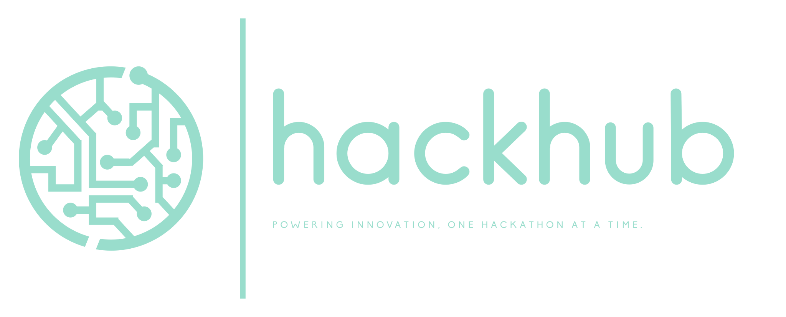

#  


| Document | Description |
|----------|-------------|
| **[📚 Documentation Index](docs/README.md)** | Complete documentation overview and navigation guide |
| **[🛠️ Setup Guide](docs/SETUP.md)** | Comprehensive local development setup instructions |
| **[📋 User Guide](docs/USER_GUIDE.md)** | Complete platform usage guide for all user types |
| **[🏗️ Architecture](docs/ARCHITECTURE.md)** | System design, components, and technical decisions |
| **[🔧 API Reference](docs/API.md)** | Database schema, endpoints, and integration examples |
| **[🚀 Deployment](docs/DEPLOYMENT.md)** | Production deployment and scaling guide |

---


[](https://choosealicense.com/licenses/mit/)
[](https://www.typescriptlang.org/)
[](https://reactjs.org/)
[](https://supabase.com/)
[](https://vitejs.dev/)
[](https://pages.cloudflare.com/)


> **A modern, comprehensive platform for managing hackathons, fostering team collaboration, and showcasing innovative ideas.**

HackHub streamlines the entire hackathon lifecycle from registration to project submission, providing managers with powerful tools to organize events and participants with intuitive collaboration features.

## ✨ Features

### 👥 For Participants
- **Easy Registration**: Join hackathons with simple access keys
- **Team Formation**: Create or join teams with skill-based matching
- **Idea Management**: Submit, refine, and showcase project ideas
- **Real-time Collaboration**: Live updates and notifications
- **Voting System**: Community-driven idea evaluation

### 🛠️ For Managers
- **Event Creation**: Comprehensive hackathon setup and configuration
- **Participant Management**: Track registrations and team formations
- **Real-time Monitoring**: Live dashboard with event analytics
- **Flexible Workflows**: Customizable rules and submission processes

### 🎯 Core Capabilities
- **Responsive Design**: Works seamlessly on all devices
- **Real-time Updates**: Live synchronization across all users
- **Secure Authentication**: Robust user management with Supabase Auth
- **Scalable Architecture**: Built for events of any size
- **Modern Tech Stack**: Latest web technologies for optimal performance

## 🚀 Quick Start

### Prerequisites
- Node.js 24.1.0+ and npm
- Git
- Modern web browser

### ⚡ Super Quick Start (Recommended)

```bash
git clone https://github.com/kinncj/hackathon.git
cd hackathon
make setup      # Complete setup (installs deps, starts Supabase, creates accounts)
make start      # Start development servers
```

Visit `http://localhost:5173` to see HackHub in action! 🎉

### 🔧 Manual Setup (Alternative)

If you prefer manual setup or don't have `make` available:

1. **Clone and Install**
   ```bash
   git clone https://github.com/kinncj/hackathon.git
   cd hackathon
   npm install
   ```

2. **Environment Configuration**
   ```bash
   cp .env.example .env.local
   # Edit .env.local with your configuration
   ```

3. **Database Setup**
   ```bash
   supabase start            # Start local Supabase
   npm run create-accounts   # Create test accounts
   npm run seed-data         # Add sample data
   ```

4. **Start Development**
   ```bash
   npm run dev               # Start development server
   ```

## 🏗️ Tech Stack

### Frontend
- **React 18** - Modern UI library with hooks and concurrent features
- **TypeScript** - Type safety and enhanced developer experience
- **Vite** - Lightning-fast build tool and development server
- **Mantine** - Feature-rich React components library
- **TanStack Query** - Powerful data synchronization
- **Zustand** - Lightweight state management

### Backend
- **Supabase** - Complete backend-as-a-service platform
- **PostgreSQL** - Robust relational database
- **Row Level Security** - Fine-grained access control
- **Real-time Subscriptions** - Live data synchronization
- **Authentication** - Secure user management

### Development & Deployment
- **ESLint & Prettier** - Code quality and formatting
- **Vitest & Playwright** - Comprehensive testing suite
- **GitHub Actions** - Automated CI/CD pipeline
- **Cloudflare Workers** - Modern deployment with global edge network
- **DevContainers** - Consistent development environment

## 📚 Documentation

Comprehensive documentation is available in the [`docs/`](docs/) folder:

| Document | Description |
|----------|-------------|
| **[� Documentation Index](docs/README.md)** | Complete documentation overview and navigation guide |
| **[🛠️ Setup Guide](docs/SETUP.md)** | Comprehensive local development setup instructions |
| **[�📋 User Guide](docs/USER_GUIDE.md)** | Complete platform usage guide for all user types |
| **[🏗️ Architecture](docs/ARCHITECTURE.md)** | System design, components, and technical decisions |
| **[🔧 API Reference](docs/API.md)** | Database schema, endpoints, and integration examples |
| **[🧪 Testing Guide](docs/TESTING.md)** | Testing strategies, tools, and best practices |
| **[🚀 Deployment](docs/DEPLOYMENT.md)** | Production deployment and scaling guide |

> 💡 **New to HackHub?** Start with the [Documentation Index](docs/README.md) for guided navigation to the right resources for your role.

## 🛠️ Development Scripts

### NPM Scripts
```bash
# Development
npm run dev                   # Start development server
npm run build                 # Build for production
npm run preview              # Preview production build
npm run lint                 # Run ESLint

# Database Management (Supabase CLI)
supabase start               # Start local Supabase
supabase stop                # Stop local Supabase
supabase status              # Check service status
supabase db reset            # Reset database to clean state

# Data Management
npm run create-accounts      # Create test user accounts
npm run seed-data            # Add sample data to database
npm run admin-cli            # Launch admin CLI tool
```

### Makefile Commands (Recommended)

For a better development experience, use our comprehensive Makefile:

```bash
# Quick Start
make help                    # Show all available commands
make setup                   # Complete local development setup
make start                   # Start all development servers
make stop                    # Stop all development servers

# Development Workflow  
make validate                # Validate project setup
make qa                      # Run quality assurance checks
make build                   # Build for production
make clean                   # Clean dependencies and artifacts

# Database Management
make db/reset                # Reset local database
make db/seed                 # Seed with sample data
make db/status               # Show database status

# Utilities
make info                    # Show project information
make ports                   # Show port usage
make version                 # Show version information
```

> 💡 **New Developer?** Run `make setup` for complete environment setup, then `make start` to begin development.

> 📖 **Full Reference**: See [MAKEFILE_REFERENCE.md](MAKEFILE_REFERENCE.md) for complete command documentation.

## 🤝 Contributing

We welcome contributions from developers of all skill levels! HackHub is built by the community, for the community.

### 📋 Quick Start for Contributors

1. **Read the Guidelines**: Check our comprehensive [Contributing Guidelines](CONTRIBUTING.md)
2. **Set Up Development**: Follow the [Setup Guide](docs/SETUP.md)
3. **Pick an Issue**: Look for [`good first issue`](https://github.com/kinncj/hackathon/labels/good%20first%20issue) labels
4. **Join the Community**: Participate in [GitHub Discussions](https://github.com/kinncj/hackathon/discussions)

### 🎯 Contribution Areas

| Area | Description | Skills Needed |
|------|-------------|---------------|
| **🐛 Bug Fixes** | Fix reported issues and improve stability | TypeScript, React, Debugging |
| **✨ Features** | Add new functionality to the platform | Full-stack development |
| **📚 Documentation** | Improve guides, add examples, fix typos | Technical writing |
| **🧪 Testing** | Add tests, improve coverage | Testing frameworks |
| **🎨 UI/UX** | Design improvements, accessibility | Design, CSS, Accessibility |
| **🔧 DevOps** | CI/CD, deployment, infrastructure | DevOps, Cloud platforms |

### 🚀 Development Workflow

```bash
# 1. Fork and clone the repository
git clone https://github.com/YOUR_USERNAME/hackathon.git
cd hackathon

# 2. Set up your development environment
npm install
cp .env.local.example .env.local
supabase start
npm run create-accounts
npm run seed-data

# 3. Create a feature branch
git checkout -b feature/amazing-feature

# 4. Make your changes and test thoroughly
npm run dev          # Development server
npm run lint         # Check code style

# 5. Commit with conventional commits
git commit -m "feat: add amazing feature"

# 6. Push and create a Pull Request
git push origin feature/amazing-feature
```

### 🏆 Recognition

Contributors are recognized through:
- **Contributors list** in our documentation
- **Release notes** mentions for significant contributions
- **Community highlights** in project updates
- **Maintainer track** for consistent contributors

### 📞 Getting Help

- **💬 GitHub Discussions**: Questions and community support
- **📖 Documentation**: Check [`docs/`](docs/) for comprehensive guides
- **🐛 Issues**: Report bugs or request features
- **📧 Direct Contact**: Reach out to maintainers for mentorship

> 💡 **New to Open Source?** We provide mentorship and guidance for first-time contributors. Don't hesitate to ask questions!

## 🎨 Brand Assets

HackHub provides a comprehensive set of brand assets for consistent representation across different use cases:

### 🖼️ Available Assets

| Asset Type | Formats | Usage |
|------------|---------|-------|
| **Logo** | SVG | Primary brand mark for light backgrounds |
| **Banners** | SVG, PNG | Full-width headers and marketing materials |

### 📁 Asset Variants

All assets are available in the [`assets/`](assets/) directory:

```
assets/
├── green_logo.svg          # Primary logo (green, SVG)
├── green_logo.png          # Primary logo (green, PNG)
├── green_banner.svg        # Green banner (SVG)
├── green_banner.png        # Green banner (PNG)
├── green_black_banner.png  # Green & black banner (PNG)
├── black_banner.svg        # Black banner (SVG)
├── black_banner.png        # Black banner (PNG)
├── white_banner.svg        # White banner (SVG)
└── white_banner.png        # White banner (PNG)
```

### 🎯 Usage Guidelines

- **Primary Logo**: Use `green_logo.svg` for most applications
- **Dark Backgrounds**: Use white banner variants
- **Light Backgrounds**: Use green or black banner variants
- **Presentations**: PNG versions available for better compatibility
- **Web**: SVG versions recommended for crisp scaling

### 🖼️ Preview

| Logo | Green Banner | Black Banner | White Banner |
|------|--------------|--------------|--------------|
|  |  |  |  |

> 💡 **Vector First**: Always prefer SVG versions for web use - they scale perfectly at any size and have smaller file sizes.

## 🔐 Security

Security is a top priority. Please report vulnerabilities privately to [security@hackhub.dev](mailto:security@hackhub.dev).

### Security Features
- **Row Level Security (RLS)** on all database tables
- **JWT-based authentication** with secure token management
- **Input validation** and sanitization
- **HTTPS enforcement** in production
- **Content Security Policy** headers
- **Regular security audits** and dependency updates

## 📄 License

This project is licensed under the MIT License - see the [LICENSE](LICENSE) file for details.

## 👨‍💻 Author

**Kinn Coelho Juliao** ([@kinncj](https://github.com/kinncj))

## 👷 Maintainers

**Kinn Coelho Juliao** ([@kinncj](https://github.com/kinncj))

---

## 🌟 Star History

⭐ **Star this repository if you find HackHub useful!**

It helps us understand the community interest and motivates continued development.

## 🤝 Support

- 📚 **Documentation**: Comprehensive guides in the `docs/` folder
- 🐛 **Issues**: Report bugs and feature requests on [GitHub Issues](https://github.com/kinncj/hackathon/issues)
- 💬 **Discussions**: Join our community on [GitHub Discussions](https://github.com/kinncj/hackathon/discussions)
- 📧 **Contact**: Reach out at [contact@hackhub.dev](mailto:contact@hackhub.dev)

---

<p align="center">
  <strong>Built with ❤️ for the hackathon community</strong>
</p>
