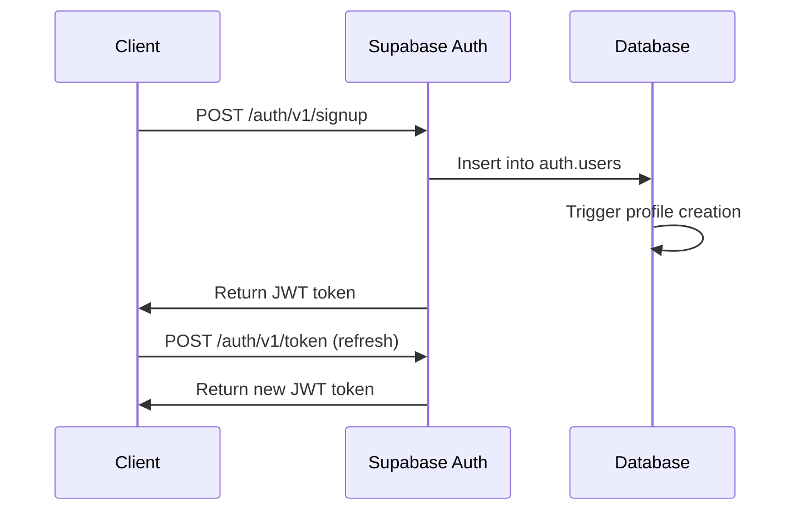

# 🔧 API Reference

> **🚧 Development Notice**: HackHub is currently under active development. Some API endpoints are fully functional while others are in progress or use mock data. For detailed implementation status, see our **[Development Status Guide](DEVELOPMENT_STATUS.md)**.

This document provides comprehensive information about HackHub's backend API, database schema, and integration patterns. While HackHub uses Supabase as its backend, understanding the API structure is crucial for development and integration.

## ⚠️ Implementation Status

| API Category | Status | Notes |
|--------------|--------|-------|
| **Authentication** | ✅ Complete | Fully functional with Supabase Auth |
| **Core CRUD Operations** | ✅ Complete | Hackathons, teams, ideas, votes, comments |
| **Project Management** | 🔄 60% Complete | Repository URLs implemented, file uploads in progress |
| **Team Collaboration** | 🔄 40% Complete | Database ready, real-time features in development |
| **File Storage** | 🔄 30% Complete | Supabase Storage configured, UI not implemented |
| **Real-time Features** | 🔄 45% Complete | Voting/comments work, chat uses polling |

For detailed status of each feature, see **[Development Status](DEVELOPMENT_STATUS.md)**.

## Overview

HackHub's API is built on Supabase, which provides:
- **Auto-generated REST API** from PostgreSQL schema
- **Real-time subscriptions** via WebSockets
- **Authentication** with JWT tokens
- **Row Level Security** for authorization
- **File storage** with CDN

## Authentication

### Authentication Flow



### Authentication Endpoints

#### Sign Up
```http
POST /auth/v1/signup
Content-Type: application/json

{
  "email": "user@example.com",
  "password": "securepassword",
  "data": {
    "name": "John Doe"
  }
}
```

**Response:**
```json
{
  "access_token": "eyJhbGciOiJIUzI1NiIsInR5cCI6IkpXVCJ9...",
  "token_type": "bearer",
  "expires_in": 3600,
  "refresh_token": "...",
  "user": {
    "id": "550e8400-e29b-41d4-a716-446655440000",
    "email": "user@example.com",
    "user_metadata": {
      "name": "John Doe"
    }
  }
}
```

#### Sign In
```http
POST /auth/v1/token?grant_type=password
Content-Type: application/json

{
  "email": "user@example.com",
  "password": "securepassword"
}
```

#### Sign Out
```http
POST /auth/v1/logout
Authorization: Bearer <access_token>
```

### Using JWT Tokens

All API requests must include the JWT token in the Authorization header:

```http
Authorization: Bearer <access_token>
```

## Database API

Supabase automatically generates REST endpoints for all database tables:

### Base URL
```
https://your-project.supabase.co/rest/v1/
```

### Common Headers
```http
Authorization: Bearer <access_token>
Content-Type: application/json
apikey: <your_supabase_anon_key>
```

### Standard Operations

#### GET (Select)
```http
GET /rest/v1/hackathons
GET /rest/v1/hackathons?select=id,title,description
GET /rest/v1/hackathons?id=eq.123
```

#### POST (Insert)
```http
POST /rest/v1/hackathons
Content-Type: application/json

{
  "title": "AI Challenge 2024",
  "description": "Build AI solutions",
  "start_date": "2024-03-01T09:00:00Z",
  "end_date": "2024-03-03T18:00:00Z"
}
```

#### PATCH (Update)
```http
PATCH /rest/v1/hackathons?id=eq.123
Content-Type: application/json

{
  "title": "Updated Title"
}
```

#### DELETE
```http
DELETE /rest/v1/hackathons?id=eq.123
```

## Project Management API

> **🚧 Development Status**: Project Management APIs are 60% complete. Repository URLs and demo URLs are fully functional. Project attachments use JSON structure but file upload UI is in development. See [Development Status](DEVELOPMENT_STATUS.md#-project-management) for details.

### Project Data Endpoints

#### Update Idea with Project Information
```http
PATCH /rest/v1/ideas?id=eq.{idea_id}
Authorization: Bearer <jwt_token>
Content-Type: application/json
Prefer: return=representation

{
  "repository_url": "https://github.com/username/project-repo",
  "demo_url": "https://project-demo.vercel.app",
  "project_attachments": "[{\"id\":\"1\",\"type\":\"screenshot\",\"url\":\"https://example.com/screenshot.png\",\"title\":\"Main Interface\",\"description\":\"Project main dashboard\",\"display_order\":0}]"
}
```

> **⚠️ Note**: `project_attachments` currently stores JSON data. File upload functionality for attachments is in development.

**Response:**
```json
[
  {
    "id": "123e4567-e89b-12d3-a456-426614174000",
    "title": "AI Code Review Assistant",
    "description": "...",
    "repository_url": "https://github.com/username/project-repo",
    "demo_url": "https://project-demo.vercel.app",
    "project_attachments": "[{\"id\":\"1\",\"type\":\"screenshot\",\"url\":\"https://example.com/screenshot.png\",\"title\":\"Main Interface\",\"description\":\"Project main dashboard\",\"display_order\":0}]",
    "created_at": "2025-01-01T10:00:00Z",
    "updated_at": "2025-01-01T12:00:00Z"
  }
]
```

#### Get Team Ideas with Project Data
```http
GET /rest/v1/ideas?team_id=eq.{team_id}&select=*
Authorization: Bearer <jwt_token>
```

**Response includes enhanced project fields:**
```json
[
  {
    "id": "123e4567-e89b-12d3-a456-426614174000",
    "title": "Smart Waste Management System",
    "description": "AI-powered waste collection optimization...",
    "team_id": "789e0123-e89b-12d3-a456-426614174000",
    "category": "AI/Machine Learning",
    "tags": ["AI", "IoT", "Sustainability"],
    "repository_url": "https://github.com/HackHub-wtf/app/tree/main",
    "demo_url": "https://demo.smartwaste.app",
    "project_attachments": "[{\"id\":\"att1\",\"type\":\"screenshot\",\"url\":\"https://hackhub.wtf/assets/black_banner.svg\",\"title\":\"System Architecture\",\"description\":\"Overview of the complete system design\",\"display_order\":0},{\"id\":\"att2\",\"type\":\"demo\",\"url\":\"https://prototype.smartwaste.app\",\"title\":\"Interactive Prototype\",\"description\":\"Early prototype for testing\",\"display_order\":1}]",
    "votes": 42,
    "status": "in-progress",
    "created_at": "2025-01-01T10:00:00Z",
    "updated_at": "2025-01-01T15:30:00Z"
  }
]
```

### Team Collaboration API

> **🚧 Development Status**: Team Collaboration APIs are 40% complete. Database schemas are implemented but real-time features and file uploads are in development. See [Development Status](DEVELOPMENT_STATUS.md#-team-collaboration) for details.

#### Team Messages
```http
POST /rest/v1/team_messages
Authorization: Bearer <jwt_token>
Content-Type: application/json

{
  "team_id": "789e0123-e89b-12d3-a456-426614174000",
  "content": "Latest prototype is ready for testing!",
  "attachments": "[{\"type\":\"file\",\"url\":\"https://storage.example.com/demo-video.mp4\",\"name\":\"demo-video.mp4\"}]"
}
```

> **⚠️ Note**: Real-time messaging currently uses polling. WebSocket integration is in development.

#### Team Files
```http
POST /rest/v1/team_files
Authorization: Bearer <jwt_token>
Content-Type: application/json

{
  "team_id": "789e0123-e89b-12d3-a456-426614174000",
  "filename": "technical-specifications.pdf",
  "file_url": "https://storage.supabase.co/object/public/team-files/tech-specs.pdf",
  "file_size": 2048576,
  "mime_type": "application/pdf"
}
```

> **⚠️ Note**: File upload UI is not yet implemented. Currently stores file metadata only.

### Real-time Subscriptions

> **✅ Status**: Real-time subscriptions are fully functional for voting, comments, and team updates. Chat real-time features are in development.

#### Subscribe to Team Updates
```javascript
const teamSubscription = supabase
  .channel('team-updates')
  .on('postgres_changes', {
    event: '*',
    schema: 'public',
    table: 'teams',
    filter: `id=eq.${teamId}`
  }, (payload) => {
    console.log('Team update:', payload)
  })
  .on('postgres_changes', {
    event: '*',
    schema: 'public', 
    table: 'ideas',
    filter: `team_id=eq.${teamId}`
  }, (payload) => {
    console.log('Idea update:', payload)
  })
  .subscribe()
```

#### Subscribe to Project Changes
```javascript
const projectSubscription = supabase
  .channel('project-updates')
  .on('postgres_changes', {
    event: 'UPDATE',
    schema: 'public',
    table: 'ideas',
    filter: `repository_url=not.is.null`
  }, (payload) => {
    console.log('Project repository updated:', payload)
  })
  .subscribe()
```

> **⚠️ Note**: Team message real-time subscriptions are planned but currently use polling for updates.

## Database Schema

### Core Tables

#### profiles
User profiles and authentication data.

```sql
CREATE TABLE public.profiles (
  id UUID REFERENCES auth.users(id) ON DELETE CASCADE PRIMARY KEY,
  email TEXT UNIQUE NOT NULL,
  name TEXT,
  role TEXT CHECK (role IN ('manager', 'participant')) DEFAULT 'participant',
  bio TEXT,
  avatar_url TEXT,
  skills TEXT[],
  created_at TIMESTAMP WITH TIME ZONE DEFAULT NOW(),
  updated_at TIMESTAMP WITH TIME ZONE DEFAULT NOW()
);
```

**API Endpoints:**
- `GET /rest/v1/profiles` - List profiles
- `GET /rest/v1/profiles?id=eq.<user_id>` - Get specific profile
- `PATCH /rest/v1/profiles?id=eq.<user_id>` - Update profile

#### hackathons
Hackathon events and metadata.

```sql
CREATE TABLE public.hackathons (
  id UUID DEFAULT gen_random_uuid() PRIMARY KEY,
  title TEXT NOT NULL,
  description TEXT,
  start_date TIMESTAMP WITH TIME ZONE NOT NULL,
  end_date TIMESTAMP WITH TIME ZONE NOT NULL,
  registration_key TEXT UNIQUE NOT NULL,
  status TEXT CHECK (status IN ('draft', 'open', 'running', 'completed')) DEFAULT 'draft',
  max_team_size INTEGER DEFAULT 4,
  allowed_participants INTEGER,
  current_participants INTEGER DEFAULT 0,
  created_by UUID REFERENCES public.profiles(id) ON DELETE CASCADE NOT NULL,
  rules TEXT,
  prizes TEXT[],
  tags TEXT[],
  created_at TIMESTAMP WITH TIME ZONE DEFAULT NOW(),
  updated_at TIMESTAMP WITH TIME ZONE DEFAULT NOW()
);
```

**API Endpoints:**
- `GET /rest/v1/hackathons` - List hackathons
- `GET /rest/v1/hackathons?status=eq.open` - Filter by status
- `POST /rest/v1/hackathons` - Create hackathon (managers only)
- `PATCH /rest/v1/hackathons?id=eq.<hackathon_id>` - Update hackathon

#### teams
Team information and metadata.

```sql
CREATE TABLE public.teams (
  id UUID DEFAULT gen_random_uuid() PRIMARY KEY,
  name TEXT NOT NULL,
  description TEXT,
  hackathon_id UUID REFERENCES public.hackathons(id) ON DELETE CASCADE NOT NULL,
  created_by UUID REFERENCES public.profiles(id) ON DELETE CASCADE NOT NULL,
  is_open BOOLEAN DEFAULT true,
  max_members INTEGER DEFAULT 4,
  current_members INTEGER DEFAULT 1,
  skills TEXT[],
  created_at TIMESTAMP WITH TIME ZONE DEFAULT NOW(),
  updated_at TIMESTAMP WITH TIME ZONE DEFAULT NOW(),
  
  UNIQUE(name, hackathon_id)
);
```

**API Endpoints:**
- `GET /rest/v1/teams?hackathon_id=eq.<hackathon_id>` - Teams in hackathon
- `POST /rest/v1/teams` - Create team
- `PATCH /rest/v1/teams?id=eq.<team_id>` - Update team

#### team_members
Team membership relationships.

```sql
CREATE TABLE public.team_members (
  team_id UUID REFERENCES public.teams(id) ON DELETE CASCADE,
  user_id UUID REFERENCES public.profiles(id) ON DELETE CASCADE,
  role TEXT CHECK (role IN ('leader', 'member')) DEFAULT 'member',
  joined_at TIMESTAMP WITH TIME ZONE DEFAULT NOW(),
  
  PRIMARY KEY (team_id, user_id)
);
```

#### ideas
Project ideas and submissions.

```sql
CREATE TABLE public.ideas (
  id UUID DEFAULT gen_random_uuid() PRIMARY KEY,
  title TEXT NOT NULL,
  description TEXT,
  hackathon_id UUID REFERENCES public.hackathons(id) ON DELETE CASCADE NOT NULL,
  team_id UUID REFERENCES public.teams(id) ON DELETE CASCADE,
  created_by UUID REFERENCES public.profiles(id) ON DELETE CASCADE NOT NULL,
  category TEXT,
  tags TEXT[],
  votes INTEGER DEFAULT 0,
  status TEXT CHECK (status IN ('draft', 'submitted', 'in-progress', 'completed')) DEFAULT 'draft',
  created_at TIMESTAMP WITH TIME ZONE DEFAULT NOW(),
  updated_at TIMESTAMP WITH TIME ZONE DEFAULT NOW()
);
```

#### votes
Voting system for ideas.

```sql
CREATE TABLE public.votes (
  id UUID DEFAULT gen_random_uuid() PRIMARY KEY,
  idea_id UUID REFERENCES public.ideas(id) ON DELETE CASCADE NOT NULL,
  user_id UUID REFERENCES public.profiles(id) ON DELETE CASCADE NOT NULL,
  created_at TIMESTAMP WITH TIME ZONE DEFAULT NOW(),
  
  UNIQUE(idea_id, user_id)
);
```

#### comments
Comments on ideas.

```sql
CREATE TABLE public.comments (
  id UUID DEFAULT gen_random_uuid() PRIMARY KEY,
  idea_id UUID REFERENCES public.ideas(id) ON DELETE CASCADE NOT NULL,
  user_id UUID REFERENCES public.profiles(id) ON DELETE CASCADE NOT NULL,
  content TEXT NOT NULL,
  created_at TIMESTAMP WITH TIME ZONE DEFAULT NOW(),
  updated_at TIMESTAMP WITH TIME ZONE DEFAULT NOW()
);
```

#### notifications
User notification system.

```sql
CREATE TABLE public.notifications (
  id UUID DEFAULT gen_random_uuid() PRIMARY KEY,
  user_id UUID REFERENCES public.profiles(id) ON DELETE CASCADE NOT NULL,
  title TEXT NOT NULL,
  message TEXT,
  type TEXT CHECK (type IN ('info', 'success', 'warning', 'error')) DEFAULT 'info',
  read BOOLEAN DEFAULT false,
  created_at TIMESTAMP WITH TIME ZONE DEFAULT NOW()
);
```

## API Usage Examples

### JavaScript/TypeScript Client

```typescript
import { createClient } from '@supabase/supabase-js'

const supabase = createClient(
  'https://your-project.supabase.co',
  'your-anon-key'
)

// Get all hackathons
const { data: hackathons, error } = await supabase
  .from('hackathons')
  .select('*')
  .eq('status', 'open')

// Create a new team
const { data: team, error } = await supabase
  .from('teams')
  .insert({
    name: 'AI Innovators',
    description: 'Building the future with AI',
    hackathon_id: 'hackathon-uuid',
    skills: ['JavaScript', 'Python', 'Machine Learning']
  })

// Join a team
const { error } = await supabase
  .from('team_members')
  .insert({
    team_id: 'team-uuid',
    user_id: 'user-uuid',
    role: 'member'
  })

// Vote on an idea
const { error } = await supabase
  .from('votes')
  .insert({
    idea_id: 'idea-uuid',
    user_id: 'user-uuid'
  })
```

### Advanced Queries

#### Join Tables
```typescript
// Get teams with member count
const { data } = await supabase
  .from('teams')
  .select(`
    *,
    team_members(count)
  `)
  .eq('hackathon_id', hackathonId)

// Get ideas with vote count and comments
const { data } = await supabase
  .from('ideas')
  .select(`
    *,
    votes(count),
    comments(count),
    profiles(name, avatar_url)
  `)
  .eq('hackathon_id', hackathonId)
```

#### Filtering and Sorting
```typescript
// Get hackathons with pagination
const { data } = await supabase
  .from('hackathons')
  .select('*')
  .eq('status', 'open')
  .order('start_date', { ascending: true })
  .range(0, 9) // First 10 results

// Search teams by skills
const { data } = await supabase
  .from('teams')
  .select('*')
  .contains('skills', ['JavaScript'])
  .eq('is_open', true)
```

## Real-time Subscriptions

### Setting up Real-time

```typescript
// Subscribe to new hackathons
const subscription = supabase
  .channel('hackathons')
  .on('postgres_changes', {
    event: 'INSERT',
    schema: 'public',
    table: 'hackathons'
  }, (payload) => {
    console.log('New hackathon:', payload.new)
  })
  .subscribe()

// Subscribe to team updates
const teamSubscription = supabase
  .channel(`team:${teamId}`)
  .on('postgres_changes', {
    event: '*',
    schema: 'public',
    table: 'team_members',
    filter: `team_id=eq.${teamId}`
  }, (payload) => {
    console.log('Team member change:', payload)
  })
  .subscribe()
```

### Real-time Events

Available events:
- `INSERT` - New records created
- `UPDATE` - Records modified
- `DELETE` - Records deleted
- `*` - All changes

## Row Level Security (RLS)

### Security Policies

#### Profiles Policy
```sql
-- Users can only view and update their own profile
CREATE POLICY "Users can view own profile" ON public.profiles
  FOR SELECT USING (auth.uid() = id);

CREATE POLICY "Users can update own profile" ON public.profiles
  FOR UPDATE USING (auth.uid() = id);
```

#### Hackathons Policy
```sql
-- Anyone can view published hackathons
CREATE POLICY "Anyone can view published hackathons" ON public.hackathons
  FOR SELECT USING (status != 'draft' OR created_by = auth.uid());

-- Only managers can create hackathons
CREATE POLICY "Managers can create hackathons" ON public.hackathons
  FOR INSERT WITH CHECK (
    EXISTS (
      SELECT 1 FROM public.profiles 
      WHERE id = auth.uid() AND role = 'manager'
    )
  );
```

#### Teams Policy
```sql
-- Users can view teams in hackathons they've joined
CREATE POLICY "Users can view teams" ON public.teams
  FOR SELECT USING (
    EXISTS (
      SELECT 1 FROM public.hackathon_participants 
      WHERE hackathon_id = teams.hackathon_id 
      AND user_id = auth.uid()
    )
  );
```

## File Storage API

> **🚧 Development Status**: File Storage APIs are 30% complete. Supabase Storage is configured but file upload UI is not yet implemented. See [Development Status](DEVELOPMENT_STATUS.md#-file-management) for details.

### Upload Files

```typescript
// Upload team file
const { data, error } = await supabase.storage
  .from('team-files')
  .upload(`${teamId}/${fileName}`, file)

// Upload profile picture
const { data, error } = await supabase.storage
  .from('avatars')
  .upload(`${userId}/avatar.jpg`, file, {
    upsert: true
  })
```

> **⚠️ Note**: File upload UI components are not yet implemented. Storage backend is configured and ready.

### Download Files

```typescript
// Get file URL
const { data } = supabase.storage
  .from('team-files')
  .getPublicUrl(`${teamId}/${fileName}`)

// Download file
const { data, error } = await supabase.storage
  .from('team-files')
  .download(`${teamId}/${fileName}`)
```

### File Management

```typescript
// List files in directory
const { data, error } = await supabase.storage
  .from('team-files')
  .list(teamId)

// Delete file
const { error } = await supabase.storage
  .from('team-files')
  .remove([`${teamId}/${fileName}`])
```

## Error Handling

### Common Error Codes

#### Authentication Errors
- `400` - Invalid credentials
- `401` - Unauthorized (invalid/expired token)
- `403` - Forbidden (insufficient permissions)

#### Database Errors
- `409` - Conflict (duplicate key violation)
- `422` - Unprocessable Entity (validation error)
- `500` - Internal Server Error

### Error Response Format

```json
{
  "code": "23505",
  "details": "Key (email)=(user@example.com) already exists.",
  "hint": null,
  "message": "duplicate key value violates unique constraint \"profiles_email_key\""
}
```

### Error Handling Example

```typescript
const { data, error } = await supabase
  .from('teams')
  .insert(teamData)

if (error) {
  switch (error.code) {
    case '23505': // Unique constraint violation
      console.error('Team name already exists')
      break
    case '23503': // Foreign key violation
      console.error('Invalid hackathon ID')
      break
    default:
      console.error('Unexpected error:', error.message)
  }
  return
}

console.log('Team created:', data)
```

## Rate Limiting

Supabase implements rate limiting based on your subscription plan:

### Free Tier Limits
- **API Requests**: 50,000 per month
- **Auth**: 50,000 monthly active users
- **Storage**: 1GB
- **Real-time**: 2 concurrent connections

### Production Considerations
- Implement client-side caching
- Use pagination for large datasets
- Batch operations when possible
- Monitor usage through Supabase dashboard

## Best Practices

### Query Optimization

```typescript
// Good: Select only needed columns
const { data } = await supabase
  .from('hackathons')
  .select('id, title, start_date')

// Good: Use appropriate filtering
const { data } = await supabase
  .from('teams')
  .select('*')
  .eq('hackathon_id', hackathonId)
  .limit(10)

// Bad: Select all data without filtering
const { data } = await supabase
  .from('teams')
  .select('*')
```

### Error Handling

```typescript
// Always handle errors
const { data, error } = await supabase
  .from('hackathons')
  .select('*')

if (error) {
  console.error('Error fetching hackathons:', error)
  return
}

// Process data
return data
```

### Real-time Cleanup

```typescript
// Clean up subscriptions
useEffect(() => {
  const subscription = supabase
    .channel('hackathons')
    .on('postgres_changes', {
      event: '*',
      schema: 'public',
      table: 'hackathons'
    }, handleChange)
    .subscribe()

  return () => {
    subscription.unsubscribe()
  }
}, [])
```

## API Testing

### Using curl

```bash
# Get hackathons
curl -X GET 'https://your-project.supabase.co/rest/v1/hackathons' \
  -H "Authorization: Bearer $TOKEN" \
  -H "apikey: $ANON_KEY"

# Create team
curl -X POST 'https://your-project.supabase.co/rest/v1/teams' \
  -H "Authorization: Bearer $TOKEN" \
  -H "apikey: $ANON_KEY" \
  -H "Content-Type: application/json" \
  -d '{
    "name": "Test Team",
    "hackathon_id": "hackathon-uuid"
  }'
```

### Using Postman

1. Set base URL: `https://your-project.supabase.co`
2. Add headers:
   - `Authorization: Bearer <token>`
   - `apikey: <your-anon-key>`
   - `Content-Type: application/json`
3. Test endpoints with various HTTP methods

---

This API reference provides the foundation for integrating with HackHub's backend. For specific implementation questions or advanced use cases, refer to the [Supabase documentation](https://supabase.com/docs) or contact our development team.
