# 🏗️ System Architecture

This document provides a comprehensive overview of HackHub's system architecture, including high-level design patterns, data flow, and technical decisions.

## Overview

HackHub is built as a modern, scalable web application using a jamstack architecture with real-time capabilities. The system is designed to handle concurrent users across multiple hackathons while maintaining performance and data consistency.

## System Architecture Diagram

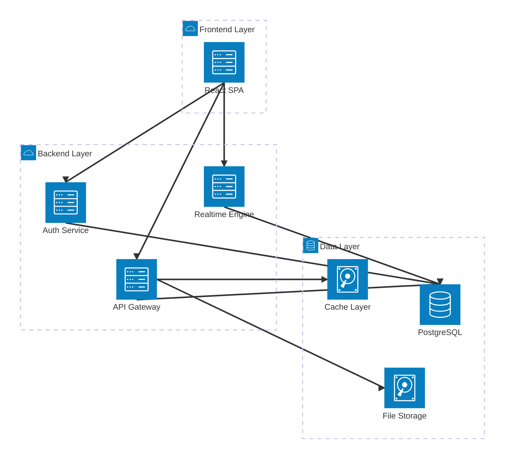

## Frontend Architecture

### Component Architecture

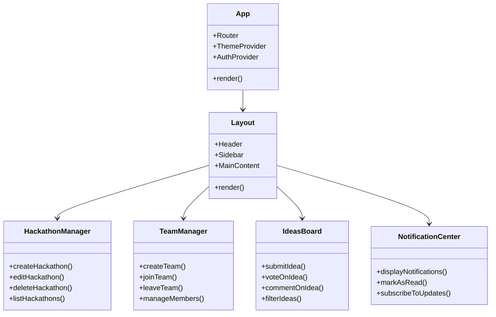

### State Management Architecture

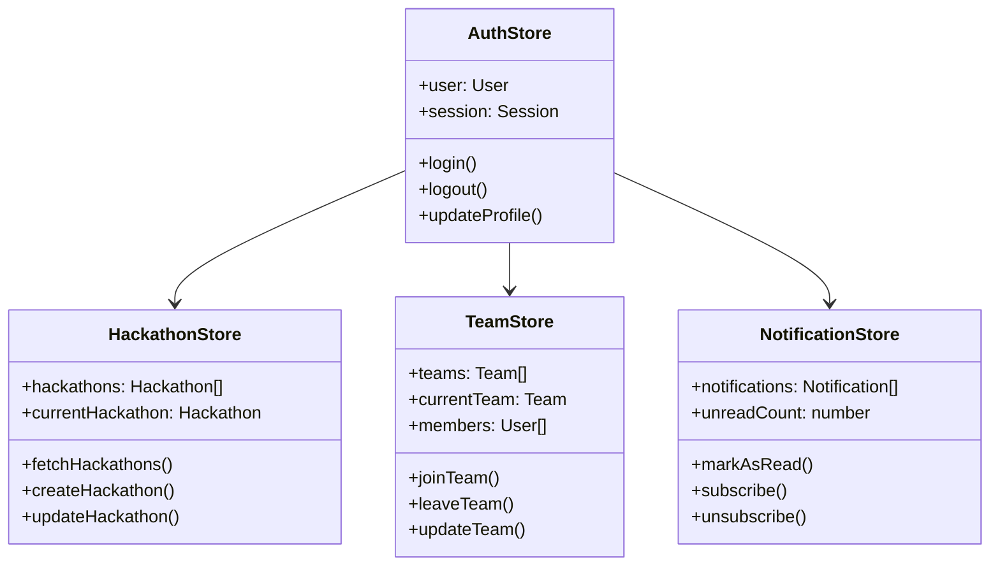

## Backend Architecture

### Supabase Services

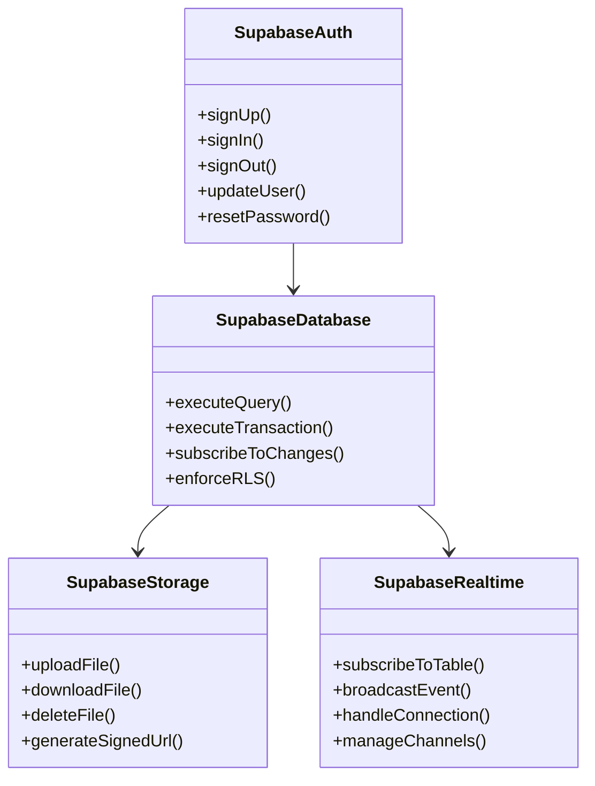

## Data Architecture

### Database Schema

```mermaid
classDiagram
    class User {
        +id: UUID
        +email: string
        +name: string
        +role: enum
        +created_at: timestamp
        +updated_at: timestamp
    }
    
    class Hackathon {
        +id: UUID
        +title: string
        +description: text
        +start_date: timestamp
        +end_date: timestamp
        +registration_key: string
        +status: enum
        +created_by: UUID
        +max_team_size: int
        +prizes: array
        +tags: array
    }
    
    class Team {
        +id: UUID
        +name: string
        +description: text
        +hackathon_id: UUID
        +created_by: UUID
        +is_open: boolean
        +skills: array
        +member_count: int
    }
    
    class Idea {
        +id: UUID
        +title: string
        +description: text
        +hackathon_id: UUID
        +team_id: UUID
        +created_by: UUID
        +category: string
        +tags: array
        +votes: int
        +status: enum
    }
    
    class TeamMember {
        +team_id: UUID
        +user_id: UUID
        +role: enum
        +joined_at: timestamp
    }
    
    class Vote {
        +id: UUID
        +idea_id: UUID
        +user_id: UUID
        +created_at: timestamp
    }
    
    class Comment {
        +id: UUID
        +idea_id: UUID
        +user_id: UUID
        +content: text
        +created_at: timestamp
        +updated_at: timestamp
    }
    
    class Notification {
        +id: UUID
        +user_id: UUID
        +title: string
        +message: text
        +type: enum
        +read: boolean
        +created_at: timestamp
    }
    
    User ||--o{ Hackathon : creates
    User ||--o{ Team : creates
    User ||--o{ Idea : submits
    User ||--o{ TeamMember : belongs_to
    User ||--o{ Vote : casts
    User ||--o{ Comment : writes
    User ||--o{ Notification : receives
    
    Hackathon ||--o{ Team : contains
    Hackathon ||--o{ Idea : hosts
    
    Team ||--o{ TeamMember : has
    Team ||--o{ Idea : develops
    
    Idea ||--o{ Vote : receives
    Idea ||--o{ Comment : has
```

## Security Architecture

### Row Level Security (RLS) Policies

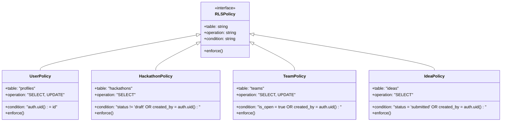

## Data Flow Architecture

### User Registration Flow

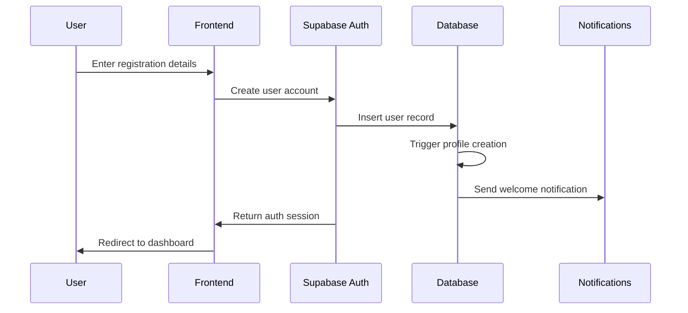

### Hackathon Creation Flow

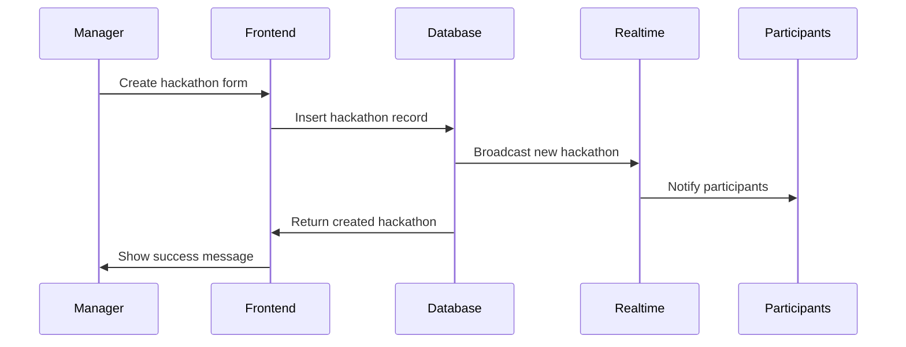

### Team Formation Flow

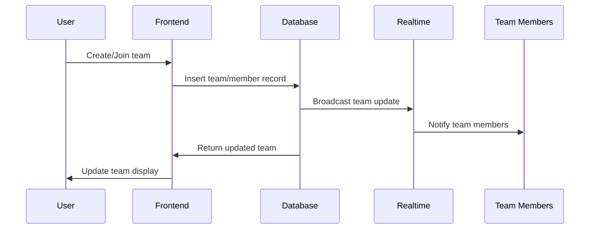

## Performance Architecture

### Caching Strategy

```mermaid
classDiagram
    class CacheStrategy {
        <<interface>>
        +key: string
        +ttl: number
        +get()
        +set()
        +invalidate()
    }
    
    class QueryCache {
        +key: "query:{hash}"
        +ttl: 300
        +strategy: "stale-while-revalidate"
        +get()
        +set()
        +invalidate()
    }
    
    class UserCache {
        +key: "user:{id}"
        +ttl: 3600
        +strategy: "cache-first"
        +get()
        +set()
        +invalidate()
    }
    
    class StaticCache {
        +key: "static:{path}"
        +ttl: 86400
        +strategy: "cache-first"
        +get()
        +set()
        +invalidate()
    }
    
    CacheStrategy <|-- QueryCache
    CacheStrategy <|-- UserCache
    CacheStrategy <|-- StaticCache
```

### Real-time Updates

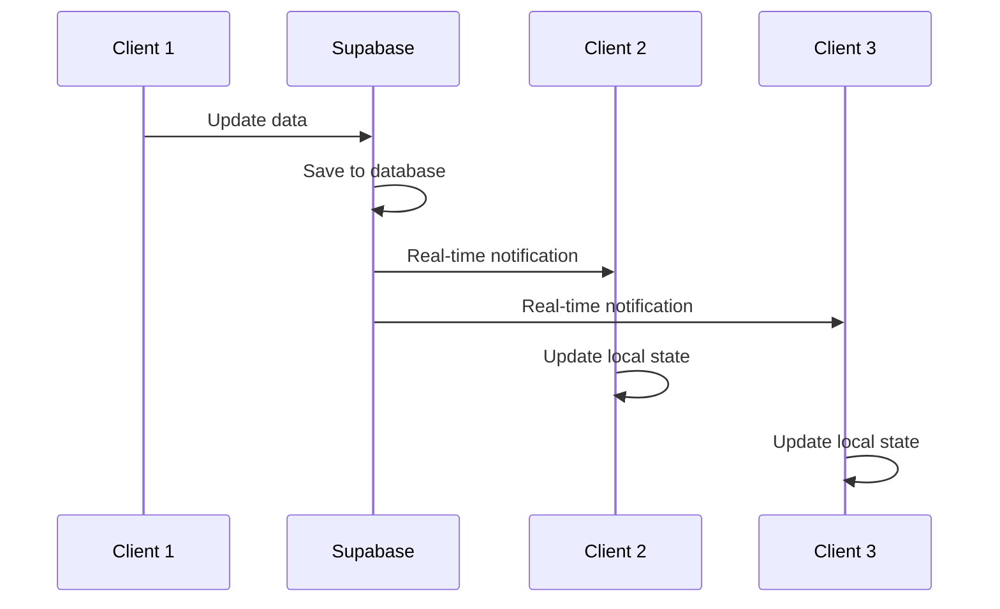

## Deployment Architecture

### Development Environment

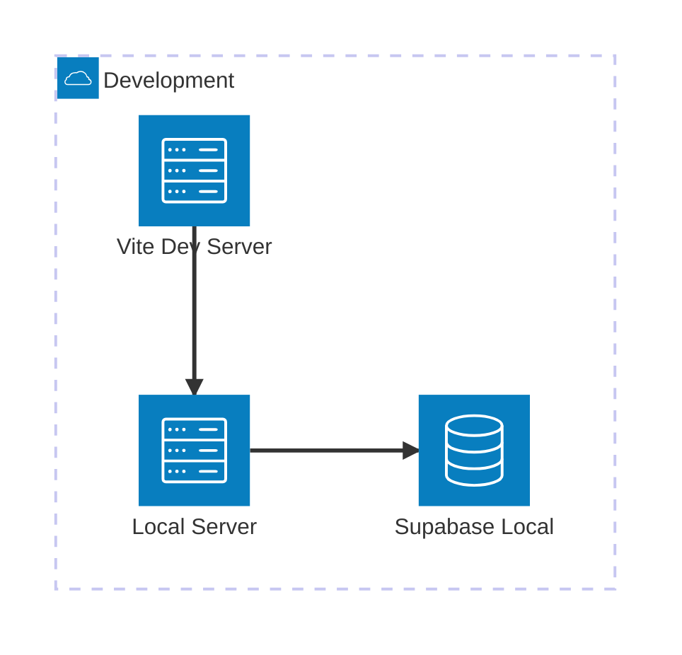

### Production Environment

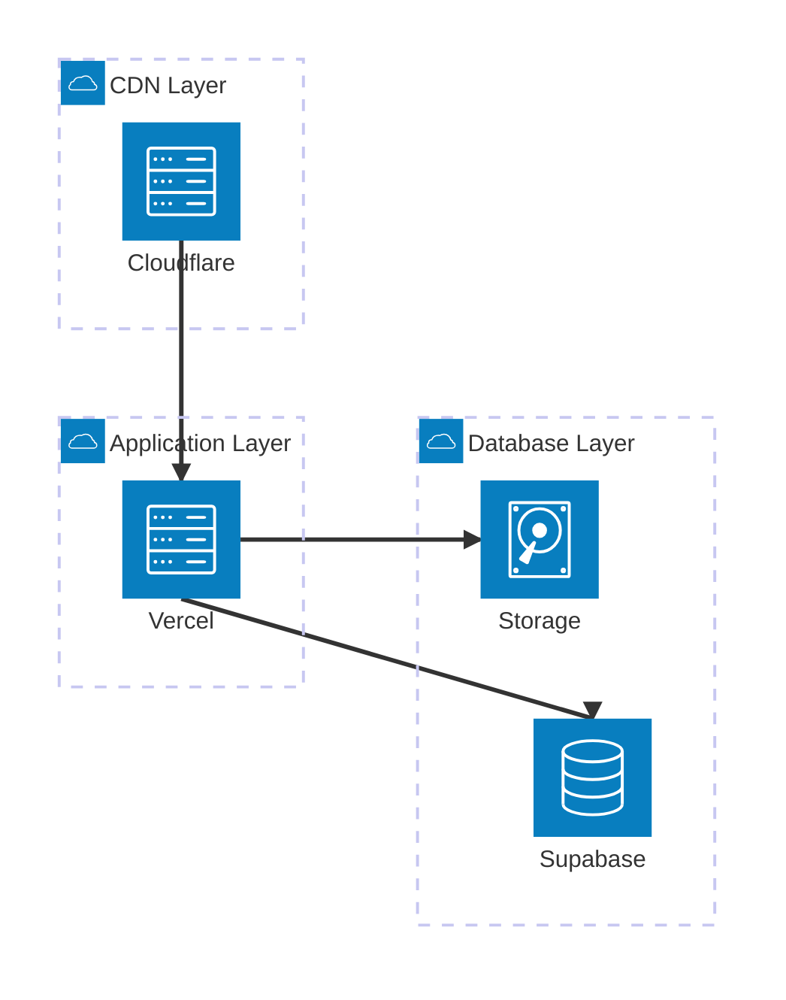

## Technology Stack Details

### Frontend Stack

- **React 18**: Modern React with concurrent features
- **TypeScript**: Type safety and developer experience
- **Vite**: Fast build tool and development server
- **Mantine v7**: Comprehensive UI component library
- **Zustand**: Lightweight state management
- **React Query**: Server state management and caching
- **React Hook Form**: Form handling and validation
- **Zod**: Runtime type validation

### Backend Stack

- **Supabase**: Backend-as-a-Service platform
- **PostgreSQL**: Primary database with JSON support
- **Row Level Security**: Database-level authorization
- **Supabase Auth**: Authentication and user management
- **Supabase Realtime**: WebSocket-based real-time updates
- **Supabase Storage**: File storage and CDN

### Development Tools

- **ESLint**: Code linting and quality assurance
- **Prettier**: Code formatting
- **TypeScript Compiler**: Static type checking
- **Supabase CLI**: Local development and migrations

## Key Architectural Decisions

### 1. Frontend-First Architecture

**Decision**: Build as a Single Page Application (SPA) with client-side routing.

**Rationale**: 
- Better user experience with instant navigation
- Reduced server load
- Easier to implement real-time features
- Better caching strategies

### 2. Supabase as Backend

**Decision**: Use Supabase instead of custom backend.

**Rationale**:
- Rapid development and deployment
- Built-in authentication and authorization
- Real-time capabilities out of the box
- Automatic API generation
- Managed infrastructure and scaling

### 3. Component-Based Architecture

**Decision**: Use Mantine component library with custom extensions.

**Rationale**:
- Consistent design system
- Accessibility built-in
- Reduced development time
- Professional appearance
- Customization capabilities

### 4. State Management Strategy

**Decision**: Hybrid approach with Zustand for global state and React Query for server state.

**Rationale**:
- Separation of concerns
- Optimistic updates
- Automatic caching and invalidation
- Reduced boilerplate
- Better developer experience

### 5. Real-time Architecture

**Decision**: Use Supabase Realtime for live updates.

**Rationale**:
- Native PostgreSQL integration
- Row-level subscriptions
- Automatic scaling
- Built-in authentication
- Reduced complexity

## Scalability Considerations

### Horizontal Scaling

- **Database**: Supabase handles read replicas and connection pooling
- **Frontend**: Static assets served via CDN
- **Real-time**: Supabase Realtime scales automatically

### Performance Optimizations

- **Code Splitting**: Route-based lazy loading
- **Bundle Optimization**: Tree shaking and dead code elimination
- **Image Optimization**: Responsive images and lazy loading
- **Caching**: Aggressive caching for static assets
- **Database**: Indexed queries and optimized schemas

### Monitoring and Observability

- **Error Tracking**: Client-side error monitoring
- **Performance Monitoring**: Core Web Vitals tracking
- **Database Monitoring**: Supabase built-in monitoring
- **User Analytics**: Usage patterns and performance metrics

## Security Considerations

### Authentication Security

- **JWT Tokens**: Secure token-based authentication
- **Session Management**: Automatic token refresh
- **Password Security**: Strong password requirements
- **Account Security**: Email verification and password reset

### Data Security

- **Row Level Security**: Database-level access control
- **Input Validation**: Client and server-side validation
- **XSS Prevention**: Content sanitization
- **CSRF Protection**: Built-in protection mechanisms

### Infrastructure Security

- **HTTPS Only**: All communications encrypted
- **Environment Variables**: Secure configuration management
- **API Keys**: Proper key management and rotation
- **Access Control**: Role-based permissions

## Future Architecture Considerations

### Microservices Migration

As the platform grows, consider migrating to microservices:
- **User Service**: Authentication and profile management
- **Hackathon Service**: Event management
- **Team Service**: Team formation and collaboration
- **Notification Service**: Real-time notifications

### Advanced Features

- **Search Service**: Elasticsearch for advanced search
- **Analytics Service**: Advanced reporting and insights
- **File Processing**: Background job processing
- **Email Service**: Transactional email handling

### Mobile Architecture

- **React Native**: Cross-platform mobile development
- **Shared Business Logic**: Code reuse between web and mobile
- **Offline Support**: Local data caching and synchronization
- **Push Notifications**: Native mobile notifications

---

This architecture provides a solid foundation for a scalable, maintainable, and performant hackathon management platform while maintaining flexibility for future enhancements and growth.
