# 🏗️ System Architecture

This document provides a comprehensive overview of HackHub's system architecture, including high-level design patterns, data flow, and technical decisions.

## Overview

HackHub is built as a modern, scalable web application using a jamstack architecture with real-time capabilities. The system is designed to handle concurrent users across multiple hackathons while maintaining performance and data consistency.

## System Architecture Diagram

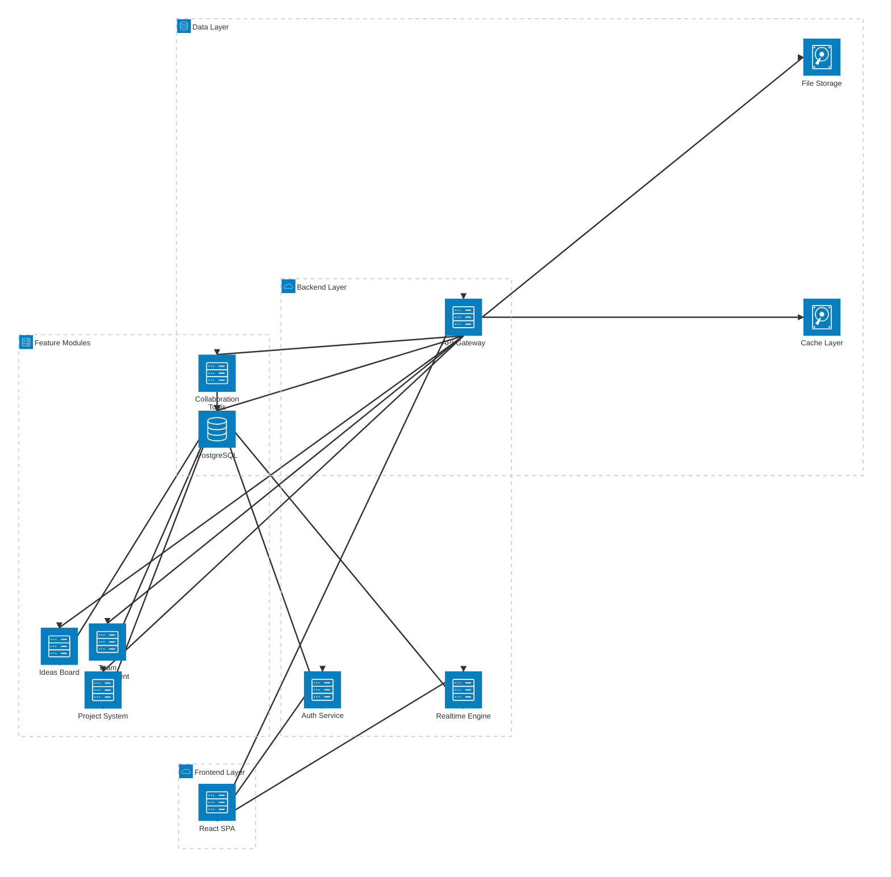

## Frontend Architecture

### Component Architecture

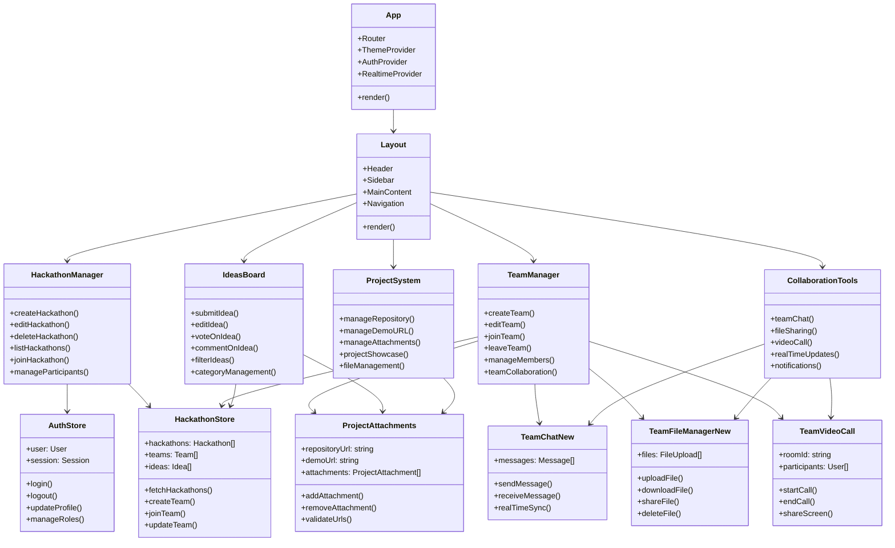

### State Management Architecture

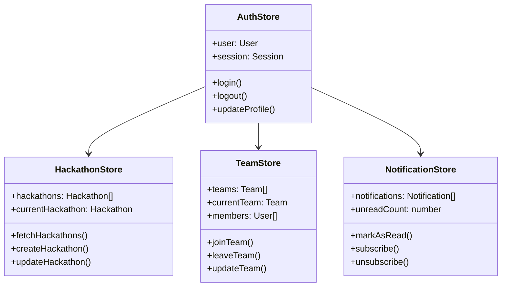

## Backend Architecture

### Supabase Services

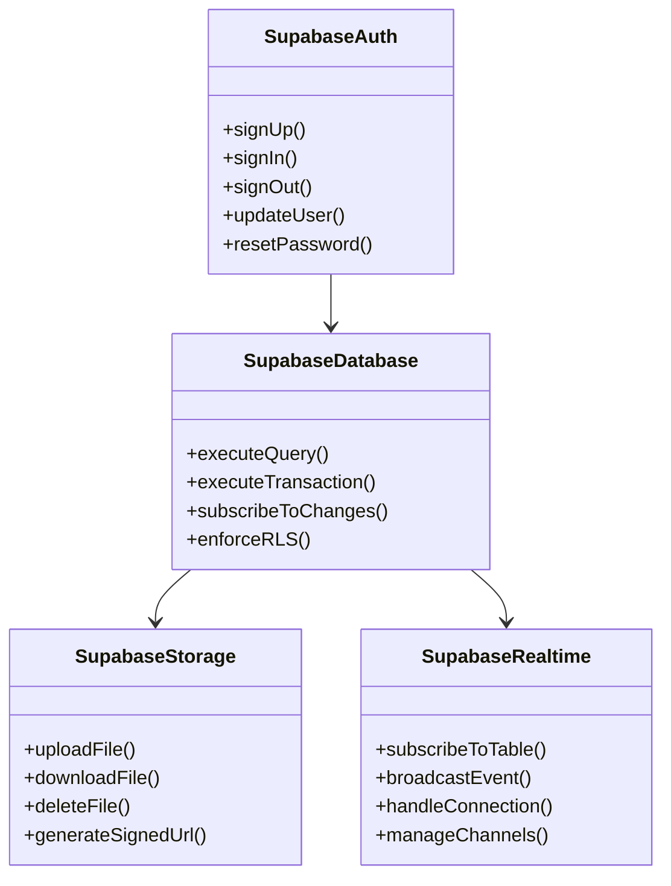

## Data Architecture

### Enhanced Database Schema

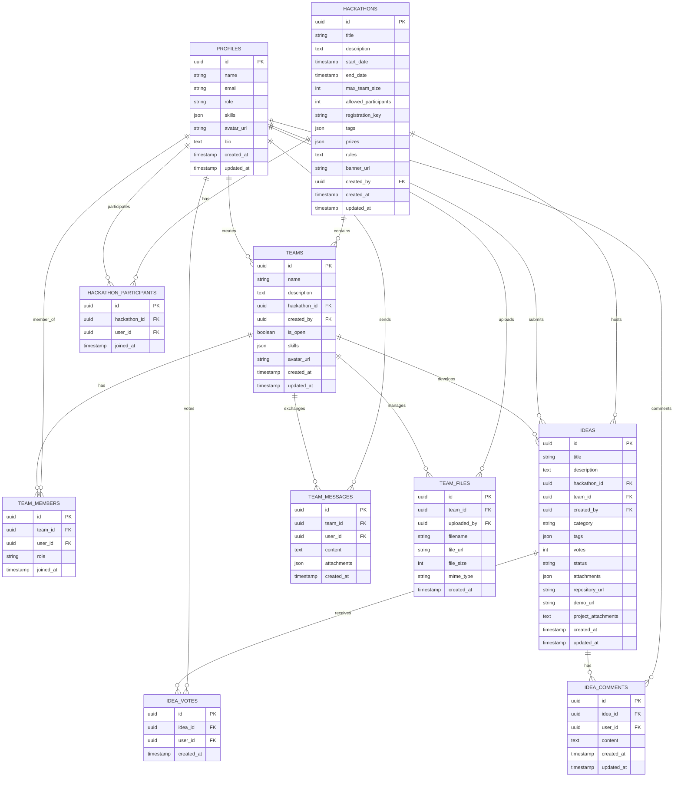

### Key Schema Enhancements

#### Project Data Integration
- **`repository_url`**: Direct storage of GitHub/GitLab repository URLs
- **`demo_url`**: Live demo or deployed project URLs  
- **`project_attachments`**: JSON field storing ProjectAttachment objects with screenshots, additional repos, and demo links

#### Team Collaboration Features
- **`TEAM_MESSAGES`**: Real-time chat functionality with attachment support
- **`TEAM_FILES`**: File sharing and management within teams
- **Role-based access**: Team leaders vs members with different permissions

#### Enhanced User Experience
- **Skill-based matching**: JSON arrays for flexible skill management
- **Comprehensive voting**: Dedicated vote tracking with user association
- **Activity tracking**: Detailed timestamps and user attribution

## Security Architecture

### Row Level Security (RLS) Policies

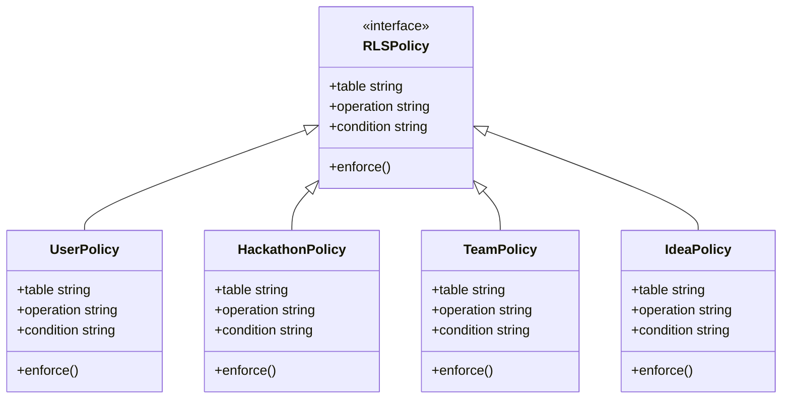

## Data Flow Architecture

### Team Creation and Project Management Flow

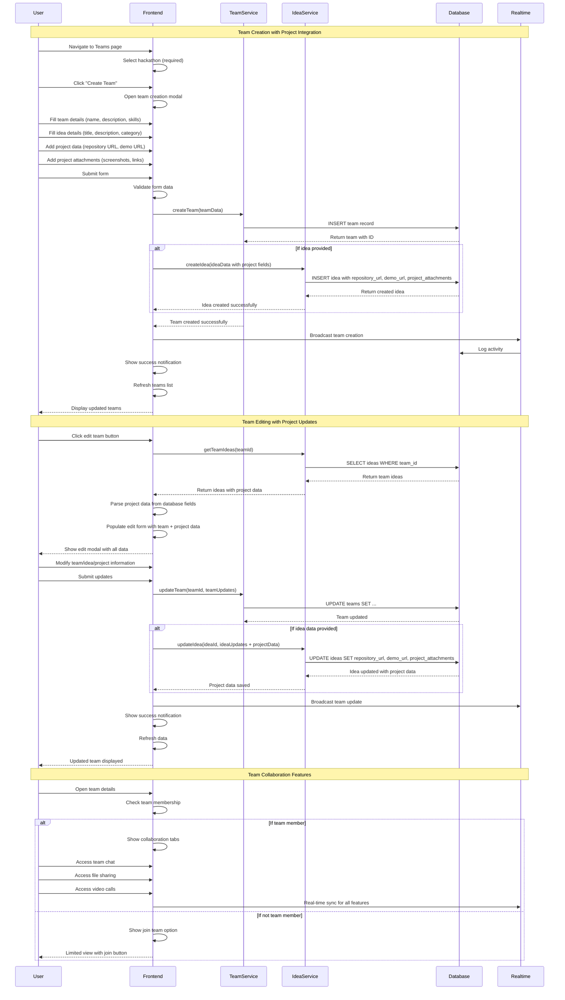

### Team Formation Flow

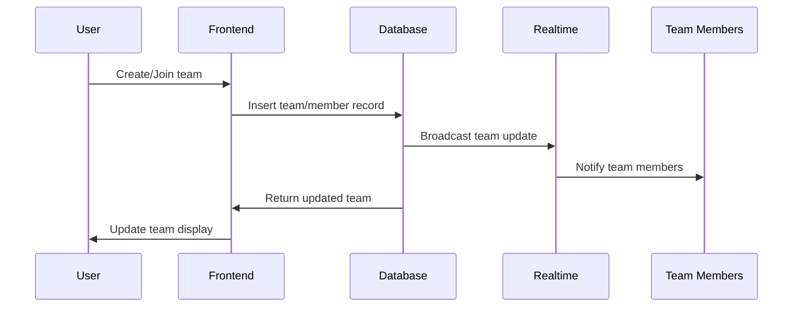

## Performance Architecture

### Caching Strategy

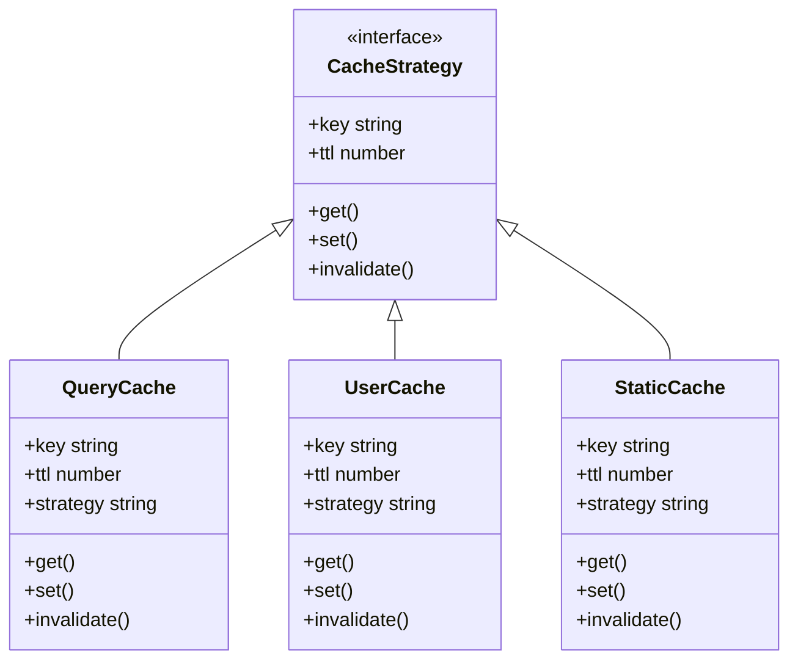

### Real-time Updates

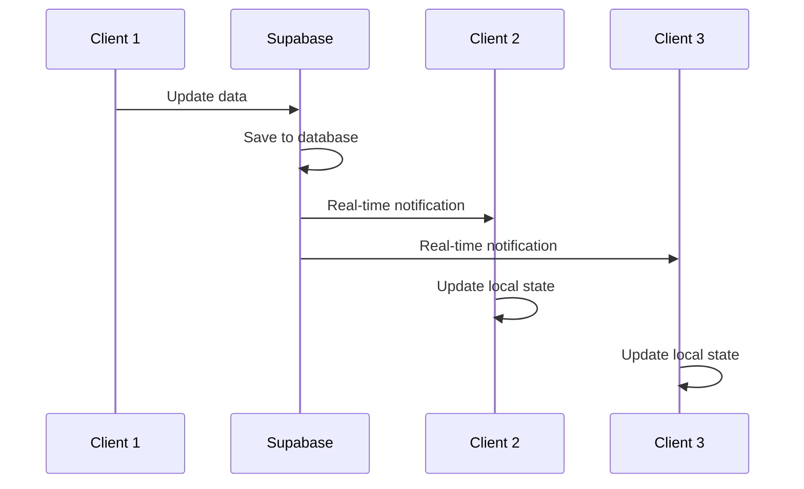

## Deployment Architecture

### Development Environment

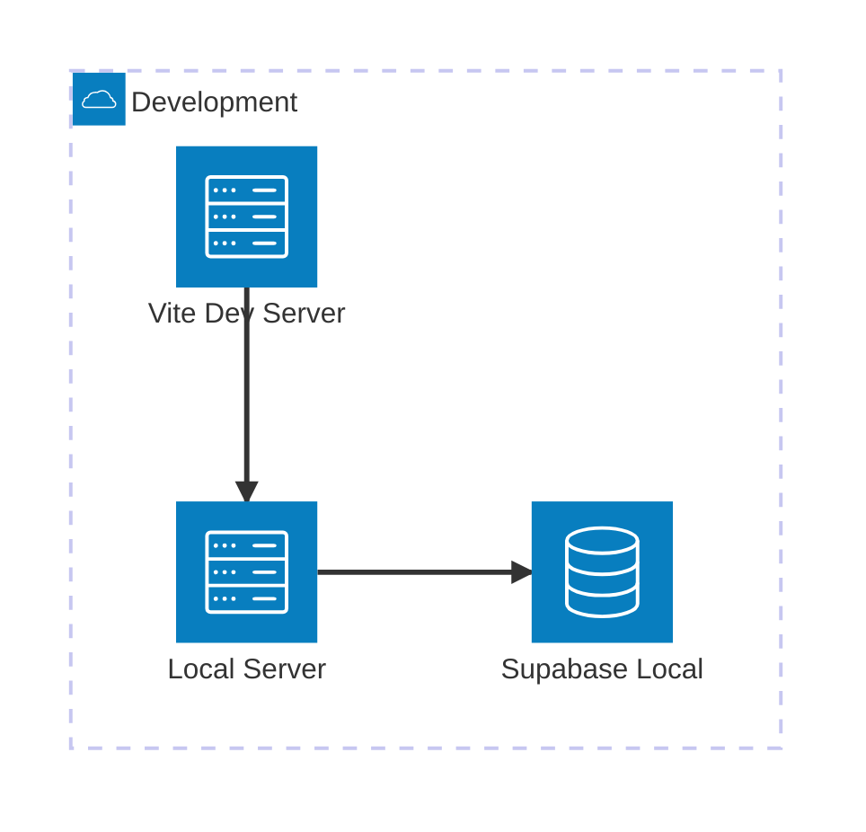

### Production Environment

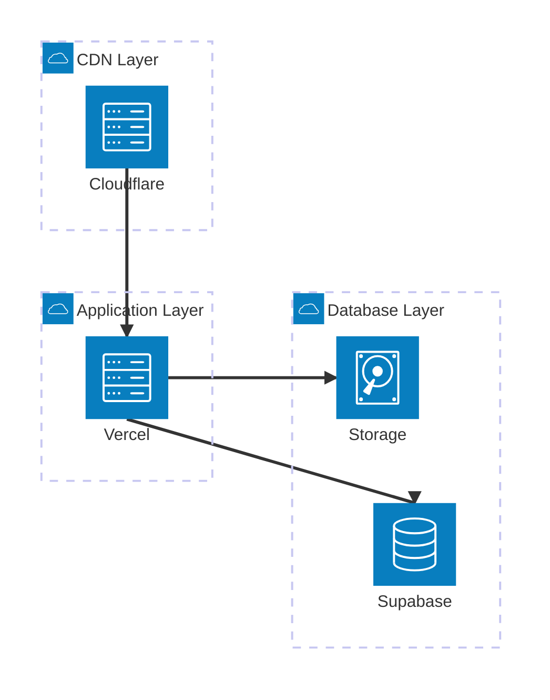

## Technology Stack Details

### Frontend Stack

- **React 18**: Modern React with concurrent features
- **TypeScript**: Type safety and developer experience
- **Vite**: Fast build tool and development server
- **Mantine v7**: Comprehensive UI component library
- **Zustand**: Lightweight state management
- **React Query**: Server state management and caching
- **React Hook Form**: Form handling and validation
- **Zod**: Runtime type validation

### Backend Stack

- **Supabase**: Backend-as-a-Service platform
- **PostgreSQL**: Primary database with JSON support
- **Row Level Security**: Database-level authorization
- **Supabase Auth**: Authentication and user management
- **Supabase Realtime**: WebSocket-based real-time updates
- **Supabase Storage**: File storage and CDN

### Development Tools

- **ESLint**: Code linting and quality assurance
- **Prettier**: Code formatting
- **TypeScript Compiler**: Static type checking
- **Supabase CLI**: Local development and migrations

## Key Architectural Decisions

### 1. Frontend-First Architecture

**Decision**: Build as a Single Page Application (SPA) with client-side routing.

**Rationale**: 
- Better user experience with instant navigation
- Reduced server load
- Easier to implement real-time features
- Better caching strategies

### 2. Supabase as Backend

**Decision**: Use Supabase instead of custom backend.

**Rationale**:
- Rapid development and deployment
- Built-in authentication and authorization
- Real-time capabilities out of the box
- Automatic API generation
- Managed infrastructure and scaling

### 3. Component-Based Architecture

**Decision**: Use Mantine component library with custom extensions.

**Rationale**:
- Consistent design system
- Accessibility built-in
- Reduced development time
- Professional appearance
- Customization capabilities

### 4. State Management Strategy

**Decision**: Hybrid approach with Zustand for global state and React Query for server state.

**Rationale**:
- Separation of concerns
- Optimistic updates
- Automatic caching and invalidation
- Reduced boilerplate
- Better developer experience

### 5. Real-time Architecture

**Decision**: Use Supabase Realtime for live updates.

**Rationale**:
- Native PostgreSQL integration
- Row-level subscriptions
- Automatic scaling
- Built-in authentication
- Reduced complexity

## Scalability Considerations

### Horizontal Scaling

- **Database**: Supabase handles read replicas and connection pooling
- **Frontend**: Static assets served via CDN
- **Real-time**: Supabase Realtime scales automatically

### Performance Optimizations

- **Code Splitting**: Route-based lazy loading
- **Bundle Optimization**: Tree shaking and dead code elimination
- **Image Optimization**: Responsive images and lazy loading
- **Caching**: Aggressive caching for static assets
- **Database**: Indexed queries and optimized schemas

### Monitoring and Observability

- **Error Tracking**: Client-side error monitoring
- **Performance Monitoring**: Core Web Vitals tracking
- **Database Monitoring**: Supabase built-in monitoring
- **User Analytics**: Usage patterns and performance metrics

## Security Considerations

### Authentication Security

- **JWT Tokens**: Secure token-based authentication
- **Session Management**: Automatic token refresh
- **Password Security**: Strong password requirements
- **Account Security**: Email verification and password reset

### Data Security

- **Row Level Security**: Database-level access control
- **Input Validation**: Client and server-side validation
- **XSS Prevention**: Content sanitization
- **CSRF Protection**: Built-in protection mechanisms

### Infrastructure Security

- **HTTPS Only**: All communications encrypted
- **Environment Variables**: Secure configuration management
- **API Keys**: Proper key management and rotation
- **Access Control**: Role-based permissions

## Future Architecture Considerations

### Microservices Migration

As the platform grows, consider migrating to microservices:
- **User Service**: Authentication and profile management
- **Hackathon Service**: Event management
- **Team Service**: Team formation and collaboration
- **Notification Service**: Real-time notifications

### Advanced Features

- **Search Service**: Elasticsearch for advanced search
- **Analytics Service**: Advanced reporting and insights
- **File Processing**: Background job processing
- **Email Service**: Transactional email handling

### Mobile Architecture

- **React Native**: Cross-platform mobile development
- **Shared Business Logic**: Code reuse between web and mobile
- **Offline Support**: Local data caching and synchronization
- **Push Notifications**: Native mobile notifications

---

This architecture provides a solid foundation for a scalable, maintainable, and performant hackathon management platform while maintaining flexibility for future enhancements and growth.
