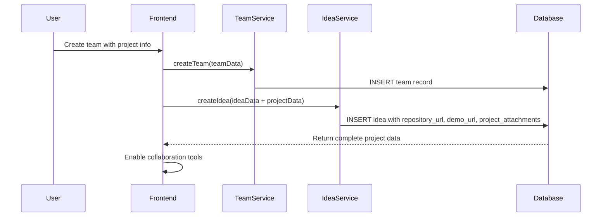
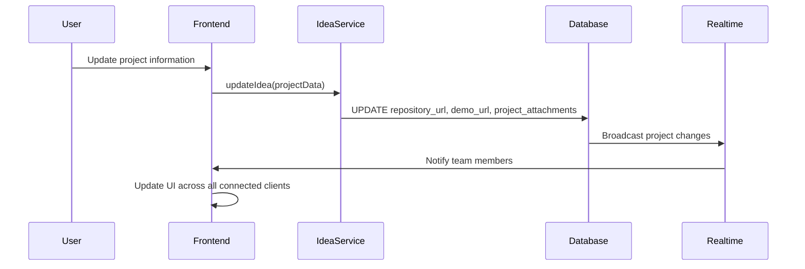

# 🚀 Project Management Features

This document provides comprehensive coverage of HackHub's advanced project management and collaboration features that were implemented to support real-world hackathon workflows.

## Overview

HackHub's project management system goes beyond simple idea submission to provide a complete development and collaboration environment for hackathon teams. The platform integrates directly with development workflows and provides tools for real-time collaboration.

## 📁 Project Data Integration

### Repository Management

#### GitHub/GitLab Integration
- **Direct URL Storage**: Teams can link their GitHub, GitLab, or other repository URLs directly to their projects
- **URL Validation**: Automatic validation ensures repository links are accessible and properly formatted
- **Multiple Repository Support**: Teams can link main repositories plus additional dependencies or forks
- **Private Repository Support**: Works with both public and private repositories

#### Database Schema
```sql
-- Enhanced IDEAS table with project fields
ALTER TABLE ideas ADD COLUMN repository_url TEXT;
ALTER TABLE ideas ADD COLUMN demo_url TEXT;
ALTER TABLE ideas ADD COLUMN project_attachments TEXT;
```

### Demo URL Management

#### Live Demo Integration
- **Deployment Links**: Teams can showcase live demos of their applications
- **Multiple Environments**: Support for staging, production, and feature-specific demos
- **Accessibility Validation**: Automatic checking to ensure demo links are accessible
- **Fallback Support**: Alternative demo options when primary links are unavailable

### Project Attachments System

#### Flexible Attachment Types
```typescript
interface ProjectAttachment {
  id: string
  type: 'screenshot' | 'repository' | 'demo'
  url: string
  title: string
  description?: string
  display_order: number
}
```

#### Attachment Categories
- **Screenshots**: Project interface images, architecture diagrams, workflow visualizations
- **Repository Links**: Additional code repositories, documentation repos, or specialized tools
- **Demo Links**: Alternative demo environments, specific feature demonstrations, or prototype versions

## 🤝 Team Collaboration Tools

### Real-time Chat System

#### Features
- **Instant Messaging**: Real-time communication between team members
- **File Attachments**: Share documents, images, and code snippets directly in chat
- **Message History**: Complete conversation history with search capabilities
- **Link Previews**: Automatic previews for shared URLs and repositories

#### Technical Implementation
```typescript
interface TeamMessage {
  id: string
  team_id: string
  user_id: string
  content: string
  attachments: MessageAttachment[]
  created_at: string
}
```

### File Sharing and Management

#### Secure File Storage
- **Team-specific Storage**: Each team has dedicated secure file storage
- **Version Control**: Track file versions and changes over time
- **Access Control**: Role-based permissions for file access and modification
- **File Type Support**: Documents, images, code files, archives, and presentations

#### Storage Integration
```typescript
interface TeamFile {
  id: string
  team_id: string
  uploaded_by: string
  filename: string
  file_url: string
  file_size: number
  mime_type: string
  created_at: string
}
```

### Video Calling Integration

#### Collaboration Features
- **Integrated Video Calls**: Built-in video conferencing for remote teams
- **Screen Sharing**: Share screens for code reviews and presentations
- **Recording Capabilities**: Record important meetings and decisions
- **Chat Integration**: Continue text chat during video calls

## 🏗️ Advanced Team Management

### Role-Based Access Control

#### Team Roles
- **Team Leader**: Full administrative access to team settings, project data, and member management
- **Team Member**: Access to collaboration tools, project viewing, and contribution capabilities
- **View-Only Access**: Non-members can view public project information and request to join

#### Permission Matrix
| Feature | Team Leader | Team Member | Non-Member |
|---------|-------------|-------------|------------|
| Edit Team Info | ✅ | ❌ | ❌ |
| Manage Project Data | ✅ | ❌ | ❌ |
| Team Chat | ✅ | ✅ | ❌ |
| File Sharing | ✅ | ✅ | ❌ |
| Video Calls | ✅ | ✅ | ❌ |
| View Project | ✅ | ✅ | ✅* |

*Limited public information only

### Team Formation and Management

#### Enhanced Team Creation
```typescript
interface TeamForm {
  // Basic team information
  name: string
  description: string
  skills: string[]
  maxMembers: number
  isOpen: boolean
  
  // Integrated idea submission
  ideaTitle: string
  ideaDescription: string
  ideaCategory: string
  ideaTags: string[]
  
  // Project management fields
  repositoryUrl: string
  demoUrl: string
  projectAttachments: ProjectAttachment[]
}
```

#### Skill-Based Matching
- **Required Skills**: Teams specify needed skills for project success
- **Skill Filtering**: Participants can find teams based on their skill sets
- **Dynamic Matching**: Real-time suggestions for optimal team formation

## 🔧 Technical Implementation

### Database Architecture

#### Core Tables
```sql
-- Enhanced IDEAS table with project management
CREATE TABLE ideas (
  id UUID PRIMARY KEY,
  title TEXT NOT NULL,
  description TEXT,
  hackathon_id UUID REFERENCES hackathons(id),
  team_id UUID REFERENCES teams(id),
  created_by UUID REFERENCES profiles(id),
  category TEXT,
  tags JSONB,
  votes INTEGER DEFAULT 0,
  status TEXT DEFAULT 'draft',
  
  -- Project management fields
  repository_url TEXT,
  demo_url TEXT,
  project_attachments TEXT, -- JSON string of ProjectAttachment[]
  
  created_at TIMESTAMP WITH TIME ZONE DEFAULT NOW(),
  updated_at TIMESTAMP WITH TIME ZONE DEFAULT NOW()
);

-- Team collaboration tables
CREATE TABLE team_messages (
  id UUID PRIMARY KEY,
  team_id UUID REFERENCES teams(id),
  user_id UUID REFERENCES profiles(id),
  content TEXT,
  attachments JSONB,
  created_at TIMESTAMP WITH TIME ZONE DEFAULT NOW()
);

CREATE TABLE team_files (
  id UUID PRIMARY KEY,
  team_id UUID REFERENCES teams(id),
  uploaded_by UUID REFERENCES profiles(id),
  filename TEXT,
  file_url TEXT,
  file_size INTEGER,
  mime_type TEXT,
  created_at TIMESTAMP WITH TIME ZONE DEFAULT NOW()
);
```

#### Performance Optimizations
```sql
-- Indexes for fast project searches
CREATE INDEX idx_ideas_repository_url ON ideas(repository_url);
CREATE INDEX idx_ideas_demo_url ON ideas(demo_url);
CREATE INDEX idx_team_messages_team_id ON team_messages(team_id);
CREATE INDEX idx_team_files_team_id ON team_files(team_id);
```

### Frontend Architecture

#### Component Structure
```
src/
├── components/
│   ├── ProjectAttachments.tsx      # Project attachment management
│   ├── TeamChatNew.tsx            # Real-time team chat
│   ├── TeamFileManagerNew.tsx     # File sharing system
│   ├── TeamVideoCall.tsx          # Video calling integration
│   └── MarkdownEditor.tsx         # Rich text editing
├── pages/
│   ├── Teams.tsx                  # Enhanced team management
│   ├── ProjectShowcase.tsx        # Project portfolio display
│   └── HackathonEdit.tsx          # Event management with project oversight
└── services/
    ├── ideaService.ts             # Project data management
    ├── teamService.ts             # Team operations
    └── supabaseClient.ts          # Database integration
```

#### State Management
```typescript
// Enhanced team state with project integration
interface TeamState {
  teams: Team[]
  selectedTeam: Team | null
  teamIdeas: IdeaWithDetails[]
  projectAttachments: ProjectAttachment[]
  collaborationTools: {
    chat: TeamMessage[]
    files: TeamFile[]
    videoCall: VideoCallState
  }
}
```

### Real-time Features

#### Live Synchronization
```typescript
// Real-time project updates
const projectSubscription = supabase
  .channel('project-updates')
  .on('postgres_changes', {
    event: '*',
    schema: 'public',
    table: 'ideas',
    filter: `team_id=eq.${teamId}`
  }, handleProjectUpdate)
  .on('postgres_changes', {
    event: '*',
    schema: 'public',
    table: 'team_messages',
    filter: `team_id=eq.${teamId}`
  }, handleChatUpdate)
  .subscribe()
```

## 📊 Data Flow and Integration

### Project Creation Workflow


### Project Update Process


## 🎯 Best Practices and Guidelines

### Repository Management
- Use clear, descriptive repository names that reflect the project purpose
- Maintain comprehensive README files with setup and deployment instructions
- Include proper documentation for APIs and key components
- Tag releases appropriately for version tracking
- Ensure repository accessibility for judges and reviewers

### Demo and Deployment
- Ensure demos are always accessible during evaluation periods
- Provide user instructions or test accounts for complex applications
- Test demos on multiple devices and browsers
- Include fallback options (videos, screenshots) if live demos fail
- Document known limitations or browser requirements

### Team Collaboration
- Establish clear communication protocols and response time expectations
- Use descriptive commit messages and pull request descriptions
- Schedule regular stand-ups and progress check-ins
- Document decisions and important discussions in team chat
- Maintain organized file structure and naming conventions

### Project Documentation
- Keep project attachments organized and up-to-date
- Use descriptive titles and descriptions for all attachments
- Include architecture diagrams and workflow visualizations
- Provide context for screenshots and demo links
- Maintain version history for important project documents

## 🔮 Future Enhancements

### Planned Features
- **GitHub Integration**: Direct repository statistics and commit tracking
- **Automated Testing**: Integration with CI/CD pipelines for project validation
- **Code Review Tools**: Built-in code review and collaboration features
- **Project Templates**: Starter templates for common hackathon project types
- **Advanced Analytics**: Team productivity and project progress metrics

### Integration Opportunities
- **Deployment Platforms**: Direct integration with Vercel, Netlify, Heroku
- **Code Quality Tools**: Integration with SonarQube, CodeClimate
- **Project Management**: Integration with Linear, Notion, Trello
- **Communication**: Enhanced Slack, Discord, and Microsoft Teams integration

## 📝 Migration Guide

For teams upgrading to the enhanced project management features:

### Database Migration
```bash
# Apply the project fields migration
supabase db diff --file add_project_fields_to_ideas

# Verify migration status
supabase db status
```

### Data Migration
Existing projects will need to migrate attachment data from the legacy `attachments` JSON field to the new `project_attachments` field format.

### Component Updates
Teams using custom implementations should update to use the new `ProjectAttachments` component for consistent project data management.

---

This comprehensive project management system transforms HackHub from a simple event management platform into a complete development and collaboration environment, supporting teams from initial idea conception through final project delivery.
