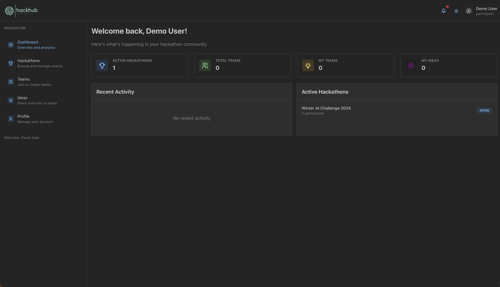

# 📸 HackHub Screenshots Guide

This document provides an overview of all available screenshots in the HackHub platform, organized by user type and functionality.

## 🗂️ Screenshot Organization

The screenshots are organized in the following structure:
```
screenshots/
├── manager/          # Manager interface screenshots
├── user/            # Participant interface screenshots
└── supabase/        # Database management screenshots
```

## 👑 Manager Interface Screenshots

### Dashboard and Overview

**File**: `manager/manager_dashboard.png`
**Purpose**: Main manager dashboard showing hackathon overview, quick stats, and navigation options.
**Features Shown**: 
- Hackathon cards with status indicators
- Quick action buttons
- Navigation sidebar
- Analytics preview

### Login Interface

**File**: `manager/manager_login.png`
**Purpose**: Login interface for hackathon managers and organizers.
**Features Shown**:
- Authentication form
- HackHub branding
- Clean, professional design
- Demo account information

### Hackathon Management

**File**: `manager/manager_hackathons.png`
**Purpose**: Overview of all hackathons managed by the user.
**Features Shown**:
- Hackathon list with status indicators
- Quick action buttons
- Search and filter options
- Create new hackathon button

### Hackathon Creation

**File**: `manager/manager_create_new_hackathon.png`
**Purpose**: Hackathon creation form with all essential fields.
**Features Shown**:
- Event details form
- Timeline configuration
- Settings options
- Form validation

### Hackathon Details View

**File**: `manager/manager_hackathon_detail.png`
**Purpose**: Detailed view of a specific hackathon with comprehensive management options.
**Features Shown**:
- Hackathon information
- Participant count
- Status indicators
- Management actions

### Team Management

**File**: `manager/manager_create_team.png`
**Purpose**: Team creation and management interface for organizers.
**Features Shown**:
- Team creation form
- Member invitation options
- Team settings
- Role assignments

### Ideas Board Management

**File**: `manager/manager_submit_idea.png`
**Purpose**: Idea submission interface for managers and participants.
**Features Shown**:
- Idea submission form
- Category selection
- Rich text editor
- Attachment options

### Profile Management

**File**: `manager/manager_profile_update.png`
**Purpose**: User profile management interface for managers.
**Features Shown**:
- Profile information form
- Avatar upload
- Account settings
- Preference options

## 👤 Participant Interface Screenshots

### Login Interface

**File**: `user/user_login_page.png`
**Purpose**: Login interface for hackathon participants.
**Features Shown**:
- User authentication form
- HackHub branding
- Demo account credentials
- Registration link

### Participant Dashboard

**File**: `user/user_dashboard.png`
**Purpose**: Main dashboard for hackathon participants in dark mode.
**Features Shown**:
- Available hackathons
- Team information
- Personal progress
- Quick actions

### Light Mode Dashboard

**File**: `user/user_dashboard_light_mode.png`
**Purpose**: Participant dashboard in light theme mode.
**Features Shown**:
- Same functionality as dark mode
- Light theme design
- Accessibility options
- Theme consistency

### Hackathon Listings

**File**: `user/user_hackathons.png`
**Purpose**: List of available hackathons for participants to join.
**Features Shown**:
- Hackathon cards
- Registration status
- Event details
- Join buttons

### Hackathon Details

**File**: `user/user_hackathon_details.png`
**Purpose**: Detailed view of hackathon information for participants.
**Features Shown**:
- Event information
- Timeline details
- Participation options
- Team formation tools

## 🗄️ Database Management Screenshots

### Supabase Studio Interface

**File**: `supabase/Screenshot_2025-07-29_at_5.27.21PM.png`
**Purpose**: Supabase Studio interface for database management.
**Features Shown**:
- Database tables
- Real-time data
- Query interface
- Management tools

## 📖 Usage in Documentation

These screenshots are integrated throughout the documentation to provide visual context:

### Setup Guide (SETUP.md)
- **Supabase Studio**: Shows developers what to expect when accessing the database management interface

### User Guide (USER_GUIDE.md)
- **Manager Dashboard**: Provides overview of manager capabilities
- **Analytics Views**: Demonstrates reporting and insights features
- **Team Management**: Shows collaboration and oversight tools
- **Ideas Board**: Illustrates idea submission and management
- **Participant Dashboard**: Shows user experience for participants

## 🔄 Updating Screenshots

When updating screenshots:

1. **Consistent Browser**: Use the same browser and window size
2. **Clean Data**: Use realistic but clean test data
3. **Proper Naming**: Follow the timestamp naming convention
4. **Appropriate Content**: Ensure screenshots show relevant features
5. **Documentation Updates**: Update corresponding documentation references

### 🤝 Contributing New Screenshots

If you're contributing new screenshots to the project:

1. **Follow File Organization**: Place screenshots in appropriate directories (`manager/`, `user/`, `supabase/`)
2. **Use Descriptive Names**: Include timestamps or clear descriptions in filenames
3. **Update Documentation**: Add entries to this guide describing the new screenshots
4. **Include Context**: Provide clear descriptions of what features are shown
5. **Test Integration**: Ensure screenshots display correctly in documentation

### 📝 Screenshot Contribution Checklist

- [ ] Screenshot is high quality and clearly readable
- [ ] Placed in appropriate directory (`screenshots/manager/`, `screenshots/user/`, etc.)
- [ ] Added entry to this SCREENSHOTS.md file with description
- [ ] Updated relevant documentation (USER_GUIDE.md, SETUP.md, etc.)
- [ ] Tested that images display correctly in rendered documentation
- [ ] Followed consistent browser/theme across related screenshots

## 🎯 Screenshot Best Practices

### Taking Screenshots
- **Full Interface**: Capture complete interface elements
- **Clear Text**: Ensure all text is readable
- **Realistic Data**: Use meaningful sample data
- **Consistent Theme**: Use the same UI theme throughout

### File Management
- **Organized Folders**: Keep screenshots in appropriate directories
- **Descriptive Names**: Use timestamps or descriptive names
- **Regular Updates**: Keep screenshots current with interface changes
- **Optimization**: Compress images for web use while maintaining quality

## 🔗 Related Documentation

- **[📋 User Guide](USER_GUIDE.md)** - Complete user documentation with integrated screenshots
- **[🛠️ Setup Guide](SETUP.md)** - Development setup with Supabase Studio views
- **[🏗️ Architecture](ARCHITECTURE.md)** - System design documentation

---

These screenshots provide comprehensive visual documentation of the HackHub platform, helping users understand the interface and functionality at a glance. 📸✨
