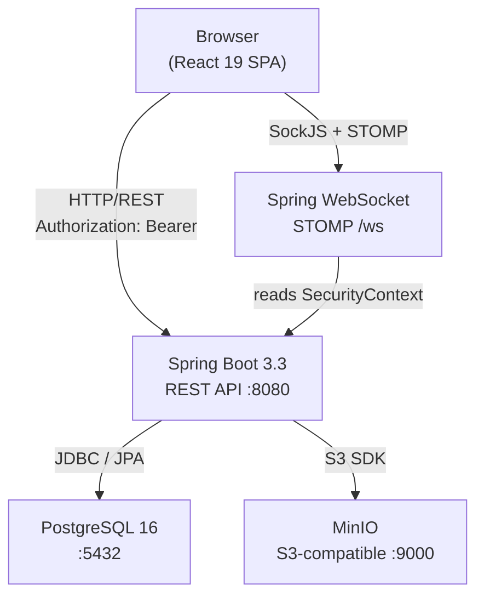
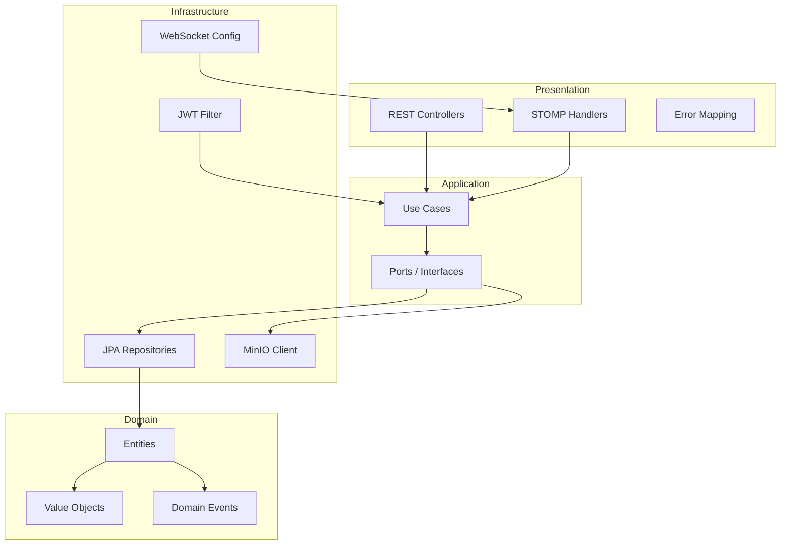
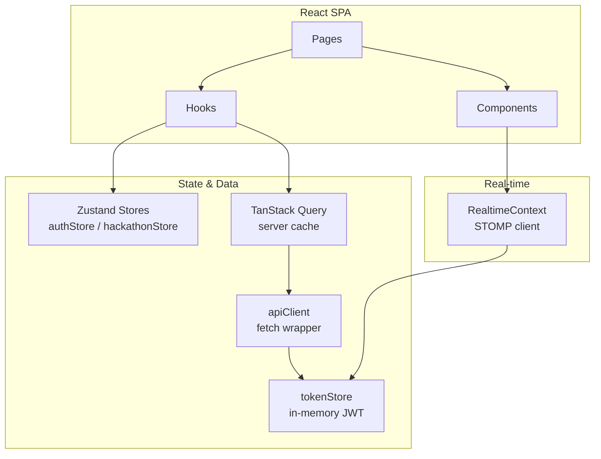

# Architecture Overview

HackHub is a self-hosted hackathon management platform built on a React 19 frontend and a Spring Boot 3.3 REST API, backed by PostgreSQL and MinIO. The system manages the full lifecycle from organisation setup through team formation, idea submission, voting, and judging.

## Clean Architecture (Backend)

The Spring Boot API follows Clean Architecture. Dependencies flow inward: outer layers depend on inner layers; inner layers never depend on outer ones.

```
presentation  →  application  →  domain  ←  infrastructure
```

| Layer | Package | Responsibility |
|---|---|---|
| Domain | `wtf.hackhub.domain` | Entities, value objects, domain events — zero framework imports |
| Application | `wtf.hackhub.application` | Use cases (one class each), ports (interfaces) |
| Infrastructure | `wtf.hackhub.infrastructure` | JPA repos, MinIO client, WebSocket config, JWT filter |
| Presentation | `wtf.hackhub.presentation` | REST controllers, STOMP handlers, DTOs, error mapping |

## C4 Context Diagram



## Backend Component Diagram



## Frontend Component Diagram



## Data Flow

```
React component
  → TanStack Query hook
    → apiClient.get/post (injects Bearer token)
      → Spring REST controller
        → Application use case
          → Domain logic
            → JPA repository → PostgreSQL
```

Real-time path:

```
React component
  → useRealtime() → RealtimeContext (STOMP client)
    → /topic/team.{id}.chat  or  /topic/hackathon.{id}.updates
      ← Spring WebSocket STOMP handler
```

## Multi-Tenancy

All data is scoped to an **Organisation**. An Organisation owns many Hackathons; each Hackathon owns Teams and Ideas. PostgreSQL row-level isolation is enforced via `organization_id` foreign keys and RLS policies on every tenant-scoped table. See [multi-tenancy.md](multi-tenancy.md) for the role hierarchy and policy details.

## ADR Index

| # | Title | Status |
|---|---|---|
| [0001](../specs/ADR-001-platform-migration.md) | Platform Migration — Supabase SPA to Self-Hosted Spring Boot | accepted |
| [0002](0002-stomp-over-socket-io.md) | STOMP/WebSocket over Socket.io | accepted |
| [0003](0003-minio-for-file-storage.md) | MinIO over Supabase Storage | accepted |
