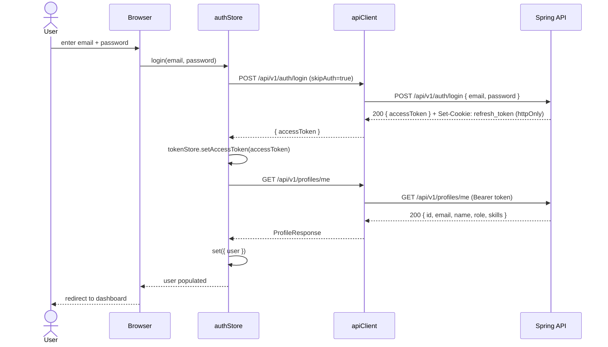
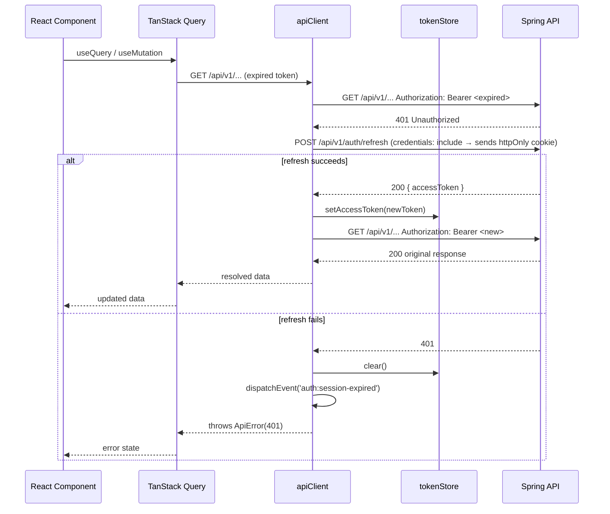
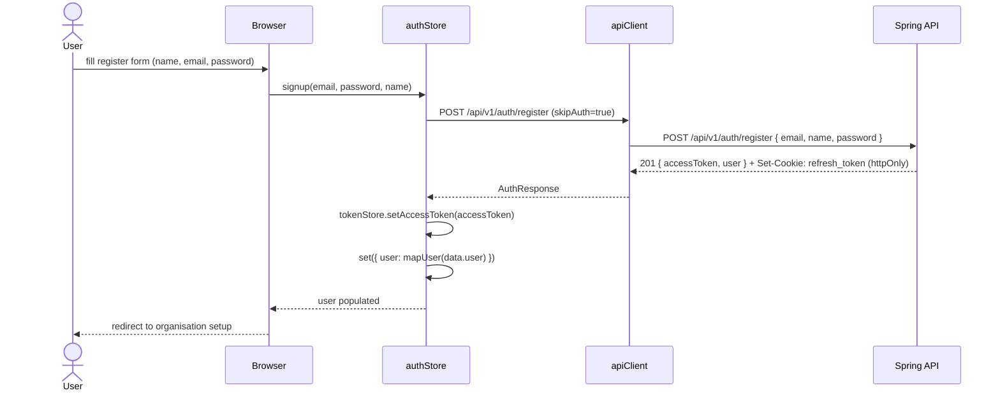
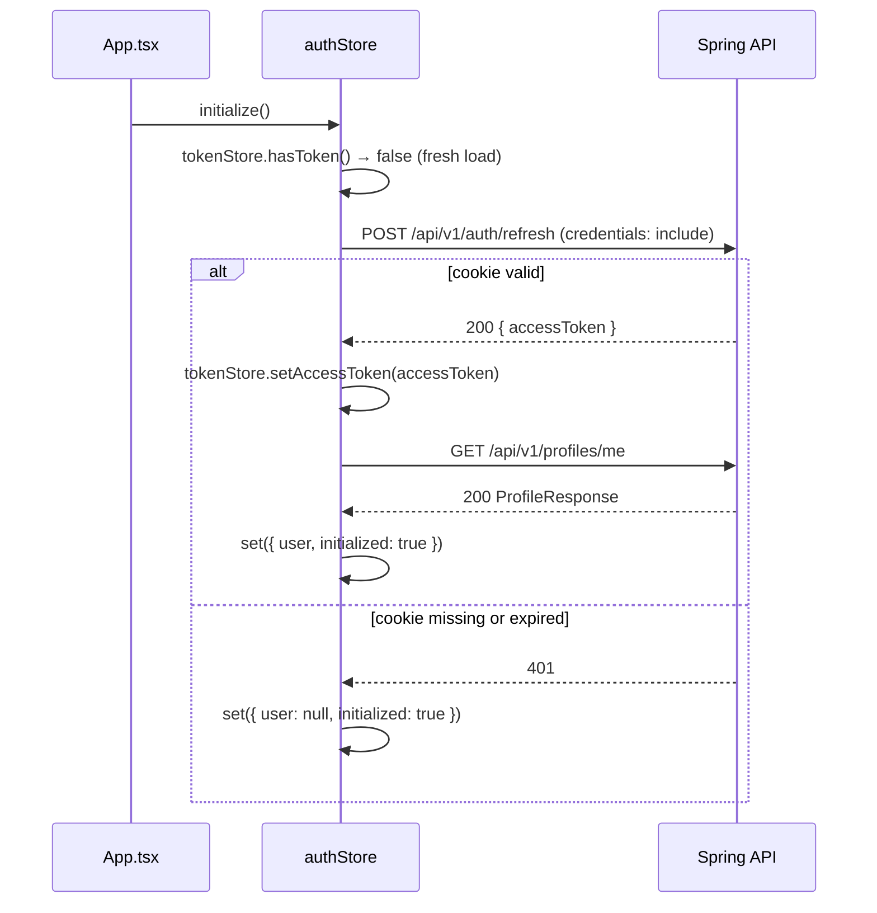
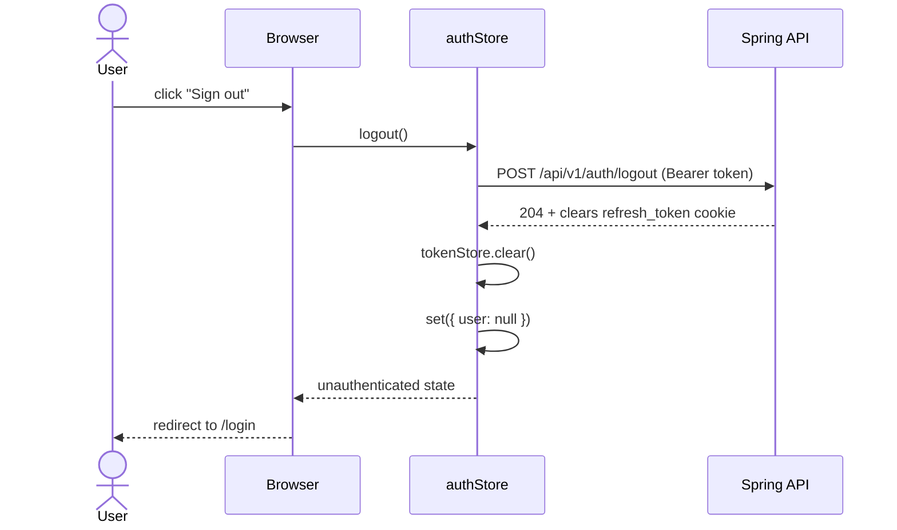

# Auth Flow

HackHub uses stateless JWT authentication with RS256-signed access tokens and httpOnly cookie-based refresh tokens. The access token lives only in memory (never `localStorage`); the refresh token is managed entirely by the server via an httpOnly `Set-Cookie` header.

## Token Storage

| Token | Where stored | TTL |
|---|---|---|
| Access token | In-memory (`tokenStore`) | 900 s (15 min) |
| Refresh token | httpOnly cookie (server-managed) | 604 800 s (7 days) |

## Login Flow

## Token Refresh Flow

When any request returns HTTP 401, `apiClient` automatically attempts a silent refresh before failing.

## Registration Flow

## Session Restore on Page Reload

On application mount, `authStore.initialize()` silently tries to restore the session from the httpOnly cookie without prompting the user.

## Logout Flow

