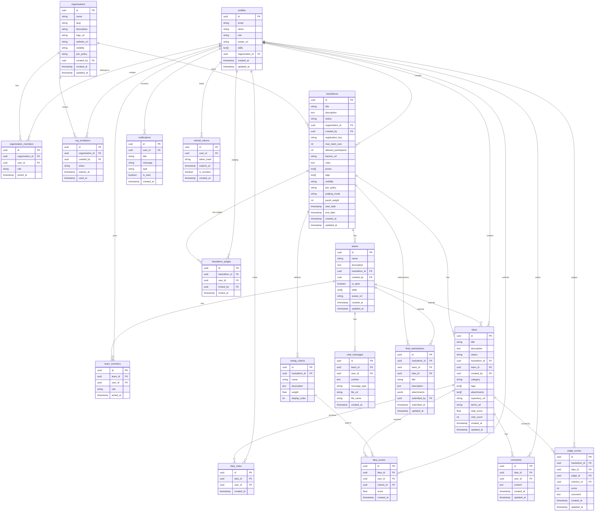

# Data Model

Full entity-relationship diagram covering all tables in the HackHub schema. All IDs are UUIDs unless noted.

## ERD

## Key Constraints

- `voting_criteria.weight` values for a hackathon must sum to 100. Validated in `VotingService.validateCriteriaWeights()`.
- `idea_votes` has a unique constraint on `(idea_id, user_id)` — one vote per user per idea.
- `idea_scores` has a unique constraint on `(idea_id, user_id, criteria_id)` — one score per criterion per judge per idea.
- `refresh_tokens.token_hash` stores a SHA-256 hash of the raw token; raw tokens are never persisted.
- `org_invitations.token` is a random opaque string; `used_at` is set on first use to prevent replay.
- `hackathon_judges` has a unique constraint on `(hackathon_id, user_id)` — a user may only be assigned once per hackathon.
- `judge_scores` has a unique constraint on `(hackathon_id, idea_id, judge_id, criterion_id)` — one score per criterion per judge per idea.
- `hackathons.panel_weight` is an integer in the range 0–100; enforced by a check constraint.
- `final_submissions` has a unique constraint on `(hackathon_id, team_id)` — one submission per team per hackathon.

## Status Enumerations

| Entity | Field | Values |
|---|---|---|
| `hackathons` | `status` | `draft`, `open`, `running`, `completed` |
| `hackathons` | `visibility` | `public`, `private` |
| `hackathons` | `join_policy` | `self_register`, `invite_only` |
| `hackathons` | `judging_mode` | `panel`, `community`, `blended` |
| `ideas` | `status` | `draft`, `submitted`, `in-progress`, `completed` |
| `profiles` | `role` | `admin`, `manager`, `participant` |
| `organizations` | `visibility` | `open`, `closed` |
| `organizations` | `join_policy` | `self_register`, `invite_only` |
| `organization_members` | `role` | `owner`, `manager`, `member`, `judge` |
| `team_members` | `role` | `leader`, `member` |
| `chat_messages` | `message_type` | `text`, `file`, `system` |
| `final_submissions` | `attachments[].type` | `pptx`, `video`, `youtube`, `github`, `bitbucket`, `url` |

## Judging

Each hackathon has a `judging_mode`:
- **community** — votes from all members (existing vote system)
- **panel** — scores from assigned judges only
- **blended** — weighted average: `(panel_score × panel_weight + community_score × (100 − panel_weight)) / 100`

Panel judges are stored in `hackathon_judges`. Scores per criterion are in `judge_scores`. The leaderboard summary endpoint applies the weight formula to produce a single `blendedScore` per idea.
