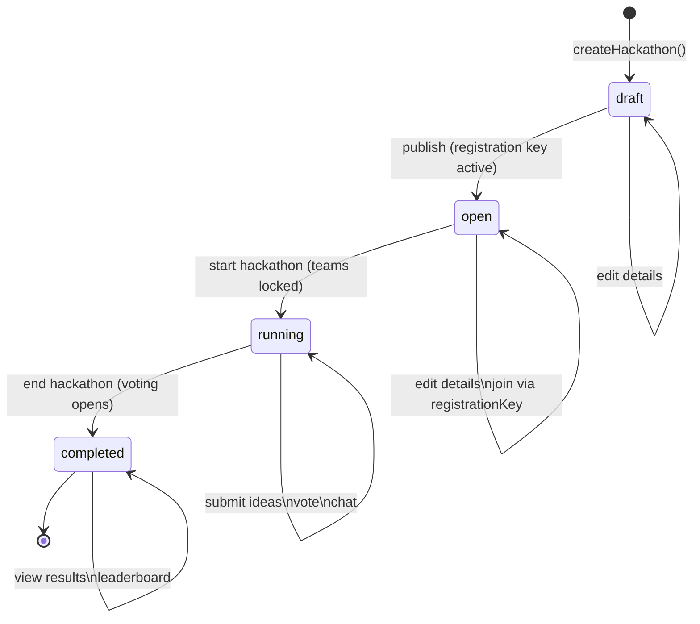
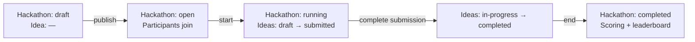

# Hackathon and Idea Lifecycle

## Hackathon Status Machine

A hackathon moves through four statuses in a strictly forward direction. Org managers and platform admins trigger transitions via `PATCH /api/v1/hackathons/{id}/status`.



### Transition Rules

| From | To | Who can trigger | Side-effects |
|---|---|---|---|
| `draft` | `open` | org manager, admin | Generates `registration_key`; participants can join |
| `open` | `running` | org manager, admin | Locks team membership; idea submission opens |
| `running` | `completed` | org manager, admin | Freezes idea submission; voting/scoring opens |

State is stored in `hackathons.status`. The frontend reads it from the `Hackathon` type in `hackathonService.ts`:

```typescript
status: 'draft' | 'open' | 'running' | 'completed'
```

Transitions are sent via `HackathonService.transitionStatus(id, newStatus)` which calls `PATCH /api/v1/hackathons/{id}/status { status }`.

## Idea Status Machine

Ideas move through their own lifecycle independently of the hackathon status.

```mermaid
stateDiagram-v2
    [*] --> draft : createIdea()

    draft --> submitted : submit for review
    submitted --> in-progress : team begins work
    in-progress --> completed : mark complete

    draft --> draft : edit idea
    submitted --> draft : retract submission
    in-progress --> in-progress : edit idea\nadd attachments\nreceive comments
    completed --> completed : view scores\nview leaderboard position
```

### Idea Status Rules

| Status | Who sets it | Meaning |
|---|---|---|
| `draft` | Creator (default) | Visible only to the team; not judged yet |
| `submitted` | Team member | Visible to all participants and judges |
| `in-progress` | Team member or manager | Work has started; idea is being developed |
| `completed` | Team member | Final state; eligible for scoring |

Status is stored in `ideas.status`. The frontend reads it from the `Idea` type in `ideaService.ts`:

```typescript
status: 'draft' | 'submitted' | 'in-progress' | 'completed'
```

## Combined Timeline


