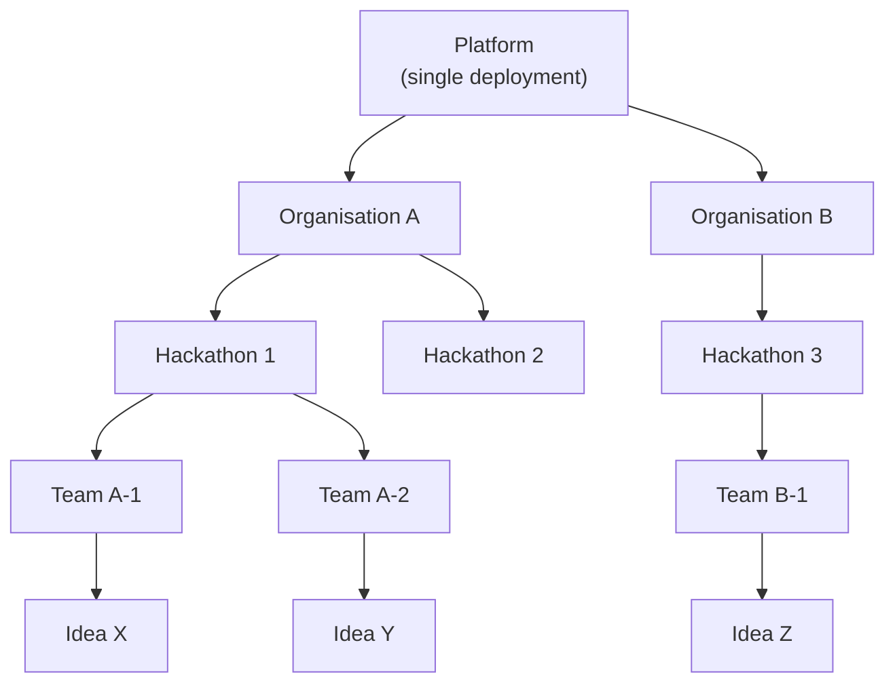
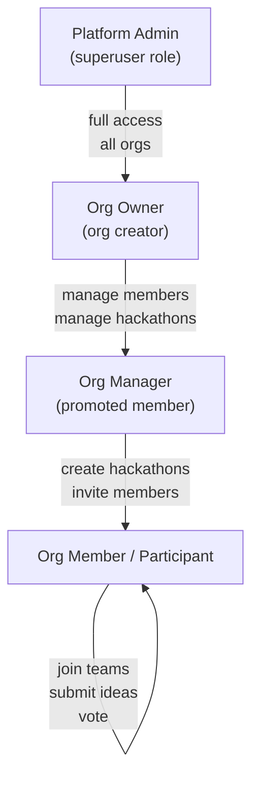
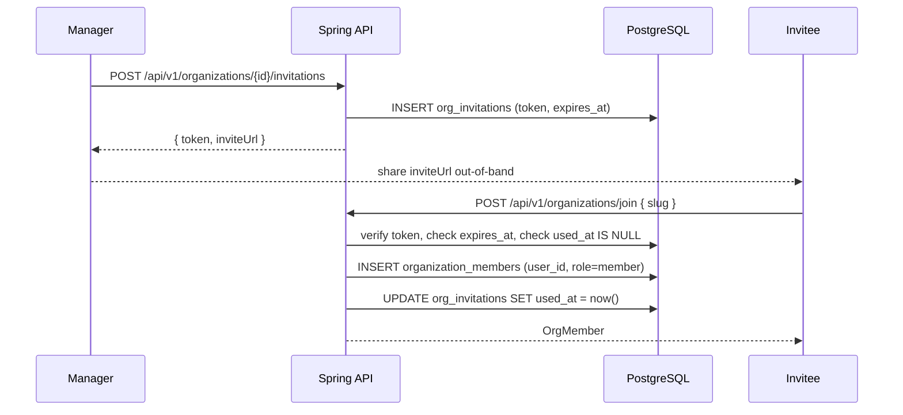

# Multi-Tenancy

HackHub is multi-tenant at the Organisation level. Every piece of data — hackathons, teams, ideas, members — is scoped to an Organisation. A single deployment serves multiple independent organisations with no data leakage between them.

## Hierarchy



## Tenant Isolation in PostgreSQL

All tenant-scoped tables carry an `organization_id` column (directly or via parent FK). PostgreSQL Row Level Security (RLS) is enabled on each of these tables so that a database user can only see rows belonging to their organisation.

The application connects as a low-privilege role. Before executing any query, the backend sets a session variable that identifies the calling user:

```sql
SET LOCAL app.current_user_id = '<uuid>';
```

RLS policies check this variable against the `organization_id` path in each table:

```sql
-- Example policy on hackathons
CREATE POLICY tenant_isolation ON hackathons
  USING (
    organization_id IN (
      SELECT organization_id
      FROM organization_members
      WHERE user_id = current_setting('app.current_user_id')::uuid
    )
  );
```

Every tenant-scoped table has an equivalent policy. Platform admins bypass RLS via a separate superuser role used only for administrative queries.

## Org visibility and join policy

Organisations have two access settings:

| Setting | Values | Effect |
|---------|--------|--------|
| `visibility` | `open` / `closed` | `open` — org profile is readable by non-members before they join. `closed` — invisible to outsiders. |
| `join_policy` | `self_register` / `invite_only` | `self_register` — any user can join using the org slug. `invite_only` — a manager must invite the user. |

Hackathons inherit a similar pair (`visibility`, `join_policy`) plus a judging-specific config (`judging_mode`, `panel_weight`). These are set independently of the parent org.

## Roles

| Role | Scope | Permissions |
|------|-------|-------------|
| `admin` | Platform | Full access to all orgs, hackathons, users |
| `manager` | Org member | Create/manage hackathons in their org |
| `owner` | Org member | Org settings, member management, invite judges |
| `member` | Org member | Participate in hackathons |
| `judge` | Org member + hackathon assignment | Score ideas in assigned hackathons |

## Role Hierarchy



| Role | Scope | Capabilities |
|---|---|---|
| `admin` (profile.role) | Platform | Manage all organisations and users via `/api/v1/admin/*` |
| `owner` (org member role) | Organisation | Full org control, promote/demote managers, delete org |
| `manager` (org member role) | Organisation | Create/edit/delete hackathons, manage hackathon lifecycle |
| `member` (org member role) | Organisation | Join hackathons via registration key, form teams |
| `leader` (team member role) | Team | Edit team, remove members |
| `member` (team member role) | Team | Submit ideas, chat, vote |

## Invitation Flow



## RBAC in Frontend

Permission checks are centralised in `src/utils/permissions.ts` and never duplicated in components. The backend re-validates every request; frontend RBAC is for UX only (hiding buttons), not for security.
