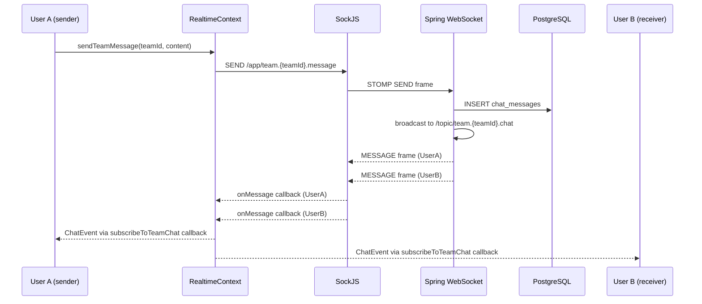
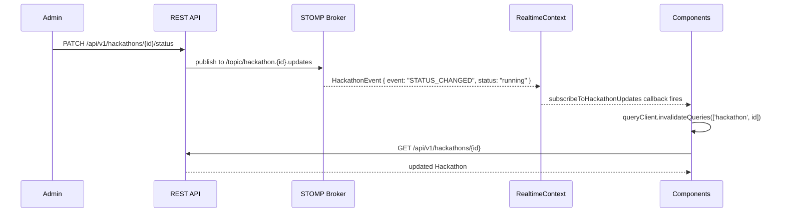
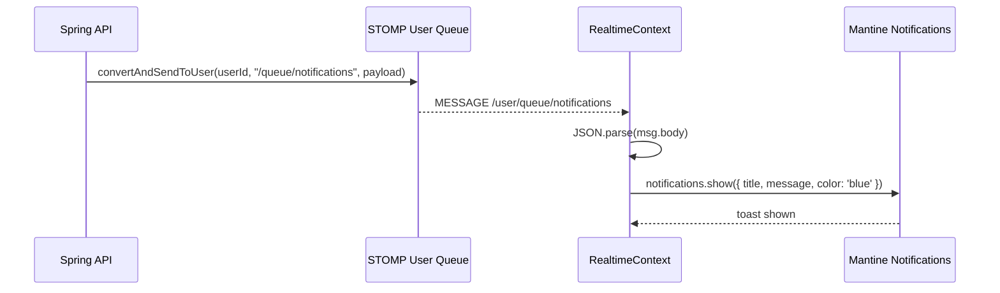

# Real-time Architecture

HackHub uses STOMP over SockJS for all real-time features. This replaces Socket.io and Supabase Realtime (see [ADR-0002](0002-stomp-over-socket-io.md)).

## Connection Setup

The STOMP client lives in `RealtimeContext.tsx` and is managed by a single `React.useEffect` keyed on the authenticated user's ID. It connects once per session and reconnects automatically with a 3-second delay.

```
WS_URL = VITE_WS_URL/ws   (default: http://localhost:8080/ws)
Transport: SockJS (HTTP long-poll fallback for restricted networks)
Auth: CONNECT frame carries  Authorization: Bearer <accessToken>
```

## STOMP Topics

| Topic | Direction | Content |
|---|---|---|
| `/topic/team.{teamId}.chat` | server → all team subscribers | `ChatEvent` JSON |
| `/topic/hackathon.{id}.updates` | server → all hackathon subscribers | `HackathonEvent` JSON |
| `/user/queue/notifications` | server → specific user | `{ title, message }` JSON |
| `/app/team.{teamId}.message` | client → server | `{ content }` JSON |

## Chat Message Flow



## Hackathon Update Events

Any server-side state change (status transition, new idea submitted, team joined) publishes an event to `/topic/hackathon.{id}.updates`. Subscribers receive a generic `HackathonEvent` with an `event` discriminator field and then decide whether to invalidate TanStack Query caches.



## User Notification Push

Per-user notifications are delivered to `/user/queue/notifications` — a STOMP user-destination that the Spring broker routes to only the connected user with that identity. The `RealtimeContext` subscribes to this destination automatically on connect and forwards notifications to Mantine's notification system.



## Subscription Lifecycle

Components call `subscribeToTeamChat` or `subscribeToHackathonUpdates` inside `useEffect`. Both helpers return an unsubscribe function that must be called on cleanup to prevent subscription leaks.

```typescript
useEffect(() => {
  const unsubscribe = subscribeToTeamChat(teamId, (msg) => {
    setMessages(prev => [...prev, msg])
  })
  return () => unsubscribe?.()
}, [teamId, subscribeToTeamChat])
```

If the STOMP client is not yet connected when a component tries to subscribe, both helpers return `null` — the component should handle this gracefully (e.g., retry after `isConnected` becomes true).
